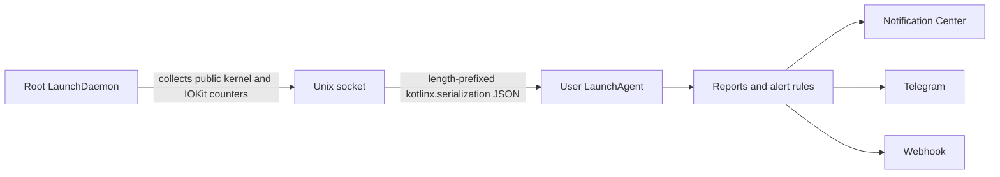

# Harmon

Harmon is a lightweight macOS workload monitor written in Kotlin/Native. It
samples processes every few minutes, groups helpers into their owning
application, explains memory and storage pressure, and can notify Notification
Center, Telegram, or an HTTPS webhook.

The project currently has no UI. It runs as two launchd services:



The privileged collector never loads user configuration or notification
credentials. The user agent never calls the process-inspection APIs directly.
Both roles currently use the same native executable, installed at different,
appropriately owned paths.

See [the collection model](docs/collection.md) for metric definitions and
[the service architecture](docs/architecture.md) for the privilege and IPC
boundary.

## What Harmon monitors

- per-process and per-application CPU over the real sampling window;
- resident, wired, physical-footprint, and lifetime-peak memory;
- a bounded per-process compressed-or-paged-out memory proxy;
- global allocated/used swap, physical compressor size, uncompressed memory
  represented in the compressor and in swap, compression/decompression rates,
  and compressor swap-I/O rates;
- physical disk reads and writes, logical writes, page-ins, faults, system
  calls, context switches, thread counts, instructions, cycles, and accounted
  energy where macOS supplies it;
- internal block-device bytes, operations, and service time from IOKit;
- root-filesystem capacity;
- system CPU, 1/5/15-minute load averages, physical memory, and power state;
- automatic `.app` grouping, including Firefox, Chromium, Electron, and other
  multi-process applications;
- alert cooldowns and thresholds for CPU, memory, physical storage writes, swap
  usage, swap-out traffic, likely battery impact, and low battery.

All local IPC and outbound JSON is encoded with `kotlinx.serialization`.
Executable paths and detailed collection failures remain local and are omitted
from normal webhook payloads.

## Important interpretation limits

### Per-process swap

macOS exposes supported global swap state, but it does not expose a supported
public `PID → bytes physically present in swap files` table. Harmon therefore
keeps three concepts separate:

- `swap.usedBytes`, from `vm.swapusage`, is the global amount of used swap
  space;
- `virtualMemory.swapBackedUncompressedBytes` is the uncompressed size of VM
  pages represented by compressor slots currently on disk. It is deliberately
  not labelled physical swap bytes and can be larger than `swap.usedBytes`;
- `compressedOrPagedOutBytes` is a per-process proxy obtained by walking public
  VM region information. It counts pages owned by the compressor pager and
  cannot distinguish pages still held in compressed RAM from pages whose
  compressor segment was written to disk.

To keep collection bounded, Harmon walks VM regions only for the 256 readable
processes with the largest physical footprint. Reports include the attribution
coverage and failure count. The proxy must not be summed and presented as exact
disk swap.

### Root access

Running the collector as root fixes the normal same-user restriction applied
by `proc_pid_rusage` and `proc_pidinfo`, so it substantially improves process
coverage. It does not disable SIP, mandatory access-control policy, or every
special protection used by macOS. Harmon keeps an inaccessible-process count
and detailed local diagnostics instead of silently treating missing processes
as zero usage.

### Battery impact

Activity Monitor's `Energy Impact` formula is private. Harmon exports macOS's
accounted nanojoule counter when available and also calculates a transparent
relative score:

```text
CPU % + wakeups/s × 0.25 + physical disk I/O MiB/s × 2
```

The score is useful for ranking and alerting, not as a wattmeter.

## Requirements

- Apple Silicon Mac;
- Xcode Command Line Tools or Xcode;
- Kotlin Toolchain 0.11.1 through the checked-in `./kotlin` wrapper;
- Kotlin 2.4.10, resolved by the toolchain.

## Build and test

```shell
./kotlin test
./kotlin build
./kotlin build --variant release
```

The release executable is written to:

```text
build/tasks/_harmon_linkMacosArm64Release/harmon.kexe
```

For a local, unprivileged IPC smoke test without installing launchd services,
start the collector in one terminal:

```shell
build/tasks/_harmon_linkMacosArm64Debug/harmon.kexe \
  collector \
  --socket /tmp/harmon-dev.sock \
  --allowed-uid "$(id -u)" \
  --allowed-gid "$(id -g)" \
  --allow-unprivileged
```

Then sample through it from another terminal:

```shell
HARMON_COLLECTOR_SOCKET=/tmp/harmon-dev.sock \
  build/tasks/_harmon_linkMacosArm64Debug/harmon.kexe \
  once --sample-seconds 2
```

This development mode intentionally has the same visibility limitations as
the current login user.

## Commands

```text
harmon collector --allowed-uid UID --allowed-gid GID [--socket PATH]
harmon run [--config PATH]
harmon once [--config PATH] [--sample-seconds N] [--notify]
harmon diagnose [--config PATH] [--sample-seconds N]
harmon check-config [--config PATH]
harmon test-notifications [--config PATH]
harmon --help
harmon --version
```

launchd owns the `collector` command in a normal installation. With no command,
Harmon starts the user-agent loop. `once` takes two collector snapshots and
prints one report. `diagnose` also prints grouping, attribution coverage, and
process-access failures.

## Configuration

Harmon reads `~/.config/harmon/config`. The installer creates it from
[config/harmon.conf.example](config/harmon.conf.example) without overwriting an
existing file.

Important defaults:

```properties
collectorSocket=/var/run/harmon.collector.sock
intervalSeconds=300
applicationCpuAlertPercent=150
applicationMemoryAlertMiB=2048
applicationDiskWriteAlertMiBPerSecond=50
swapAlertMiB=1024
swapOutAlertMiBPerSecond=25
applicationBatteryImpactAlertScore=100
batteryLowAlertPercent=20
systemNotifications=true
notifyEverySample=false
```

A threshold of `0` disables that rule. The old
`processCpuAlertPercent`, `processMemoryAlertMiB`, and
`batteryImpactAlertScore` keys remain accepted as compatibility aliases.

Notification destinations can be overridden for manual runs:

```text
HARMON_WEBHOOK_URL
HARMON_WEBHOOK_BEARER_TOKEN
HARMON_TELEGRAM_BOT_TOKEN
HARMON_TELEGRAM_CHAT_ID
HARMON_COLLECTOR_SOCKET
```

External webhooks must use HTTPS. Plain HTTP is accepted only for
`127.0.0.1`. A LaunchAgent does not inherit terminal environment variables, so
normal installations should keep secrets in the generated `0600` config file.

Validate configuration and notification delivery without printing secrets:

```shell
harmon check-config
harmon test-notifications
```

## Install with launchd

Run the installer as the login user:

```shell
./scripts/install.sh
```

It asks for sudo only for the system-owned collector files and services. It:

- builds the release executable;
- installs the user CLI at `~/.local/bin/harmon`;
- installs a root-owned copy at
  `/Library/PrivilegedHelperTools/dev.yoda.harmon`;
- registers `dev.yoda.harmon.collector` as a system LaunchDaemon;
- creates `/var/run/harmon.collector.sock`, accessible only to root and the
  configured login user;
- registers `dev.yoda.harmon.agent` in the Aqua user session;
- preserves an existing user configuration.

Inspect services and logs:

```shell
launchctl print "gui/$(id -u)/dev.yoda.harmon.agent"
sudo launchctl print system/dev.yoda.harmon.collector
tail -f ~/Library/Logs/Harmon/agent.log
sudo tail -f /Library/Logs/Harmon/collector.log
```

Remove both services and installed binaries while preserving configuration and
logs:

```shell
./scripts/uninstall.sh
```

## Project structure

```text
src/
  ipc/         versioned kotlinx.serialization protocol and Unix socket roles
  monitor/     privileged macOS collection and interval calculations
  analysis/    application grouping, alert rules, and cooldowns
  config/      user-agent configuration
  report/      text and JSON reporting
  notify/      Notification Center, webhook, and Telegram delivery
  runtime/     user-agent monitoring loop
cinterop/      libproc, Mach, sysctl, IOKit, sockets, and libcurl bridge
launchd/       LaunchDaemon and LaunchAgent templates
scripts/       install and uninstall flows
docs/          architecture and metric semantics
LICENSE        GPL-3.0-only license text
```

## License

Harmon is licensed under the
[GNU General Public License version 3 only](LICENSE) (`GPL-3.0-only`).
