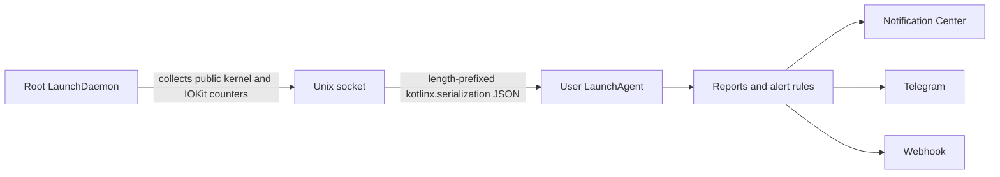

# Harmon

Harmon is a lightweight macOS workload monitor written in Kotlin/Native. It
samples processes every few minutes, groups helpers into their owning
application, explains memory and storage pressure, and can notify Notification
Center, Telegram, or an HTTPS webhook.

The project currently has no UI. It runs as two launchd services:



The privileged collector never loads user configuration or notification
credentials. The user agent never calls the process-inspection APIs directly.
Both roles currently use the same native executable, installed at different,
appropriately owned paths.

See [the collection model](docs/collection.md) for metric definitions and
[the service architecture](docs/architecture.md) for the privilege and IPC
boundary.

## What Harmon monitors

- per-process and per-application CPU over the real sampling window;
- resident, wired, physical-footprint, and lifetime-peak memory;
- a bounded per-process compressed-or-paged-out memory proxy;
- global allocated/used swap, physical compressor size, uncompressed memory
  represented in the compressor and in swap, compression/decompression rates,
  and compressor swap-I/O rates;
- physical disk reads and writes, logical writes, page-ins, faults, system
  calls, context switches, thread counts, instructions, cycles, and accounted
  energy where macOS supplies it;
- internal block-device bytes, operations, and service time from IOKit;
- root-filesystem capacity;
- system CPU, 1/5/15-minute load averages, physical memory, and power state;
- automatic `.app` grouping, including Firefox, Chromium, Electron, and other
  multi-process applications, with the terminals listed in
  `terminalApplications` treated as boundaries rather than owners of every
  command they launch;
- alerts on crossing a threshold for CPU, memory, physical storage writes, swap
  usage, swap-out traffic, likely battery impact, and low battery.

All local IPC and outbound JSON is encoded with `kotlinx.serialization`.
Executable paths and detailed collection failures remain local and are omitted
from normal webhook payloads.

## Important interpretation limits

### Per-process swap

macOS exposes supported global swap state, but it does not expose a supported
public `PID → bytes physically present in swap files` table. Harmon therefore
keeps three concepts separate:

- `swap.usedBytes`, from `vm.swapusage`, is the global amount of used swap
  space;
- `virtualMemory.swapBackedUncompressedBytes` is the uncompressed size of VM
  pages represented by compressor slots currently on disk. It is deliberately
  not labelled physical swap bytes and can be larger than `swap.usedBytes`;
- `compressedOrPagedOutBytes` is a per-process proxy obtained by walking public
  VM region information. It counts pages owned by the compressor pager and
  cannot distinguish pages still held in compressed RAM from pages whose
  compressor segment was written to disk.

To keep collection bounded, Harmon walks VM regions only for the 256 readable
processes with the largest physical footprint, and stops walking once a
per-sample budget of 100,000 regions is spent. Most of that budget goes to the
largest processes first — they are what the compressed-memory ranking is made
of, and a share too small to finish one produces nothing — and the reserved
remainder is split over the rest of the candidates. On a loaded machine the
budget, rather than the 256-process limit, is what ends attribution: the head of
the ranking is measured completely and most of the tail is truncated, so a
minority of the 256 candidates yields a value. Reports include the attribution
coverage and failure count; see [the collection model](docs/collection.md) for
the measured coverage figures. The proxy must not be summed and presented as
exact disk swap.

### Root access

Running the collector as root fixes the normal same-user restriction applied
by `proc_pid_rusage` and `proc_pidinfo`, so it substantially improves process
coverage. It does not disable SIP, mandatory access-control policy, or every
special protection used by macOS. Harmon keeps an inaccessible-process count
and detailed local diagnostics instead of silently treating missing processes
as zero usage.

### Battery impact

Activity Monitor's `Energy Impact` formula is private. Harmon exports macOS's
accounted nanojoule counter when available and also calculates a transparent
relative score:

```text
CPU % + wakeups/s × 0.25 + physical disk I/O MiB/s × 2
```

The score is useful for ranking and alerting, not as a wattmeter.

## Upgrading from an earlier build

This release corrects CPU accounting in the native bridge. `proc_pid_rusage`
returns CPU time in mach absolute time, and Harmon reported those ticks as if
they were nanoseconds. On Apple Silicon one tick is 125/3 ns, so every
per-process and per-application CPU percentage, and every battery-impact score
derived from CPU, is now about 41.7 times higher than the value Harmon printed
before: the old numbers were understated by that factor. Intel Macs have a 1:1
timebase and are unaffected.

Thresholds tuned against the old numbers must be retuned.
`applicationCpuAlertPercent` and `applicationBatteryImpactAlertScore` lowered
to compensate for the understated values now fire on almost every sample; the
same keys left at a level the old numbers could never reach begin alerting for
the first time.

Because the meaning of the CPU counters on the wire changed, the collector
protocol version is now 2. The collector (root LaunchDaemon) and the agent
(user LaunchAgent) are a matched pair and have to be reinstalled together with
`./scripts/install.sh`. A mismatched pair now fails explicitly with
`Unsupported collector protocol 1; expected 2` instead of silently reporting
CPU that is roughly 41 times too low.

## Requirements

- Apple Silicon Mac;
- Xcode Command Line Tools or Xcode;
- Kotlin Toolchain 0.11.1 through the checked-in `./kotlin` wrapper;
- Kotlin 2.4.10, resolved by the toolchain.

## Build and test

```shell
./kotlin test
./kotlin build
./kotlin build --variant release
```

The release executable is written to:

```text
build/tasks/_harmon_linkMacosArm64Release/harmon.kexe
```

For a local, unprivileged IPC smoke test without installing launchd services,
start the collector in one terminal:

```shell
build/tasks/_harmon_linkMacosArm64Debug/harmon.kexe \
  collector \
  --socket /tmp/harmon-dev.sock \
  --allowed-uid "$(id -u)" \
  --allowed-gid "$(id -g)" \
  --allow-unprivileged
```

Then sample through it from another terminal:

```shell
HARMON_COLLECTOR_SOCKET=/tmp/harmon-dev.sock \
  build/tasks/_harmon_linkMacosArm64Debug/harmon.kexe \
  once --sample-seconds 2
```

This development mode intentionally has the same visibility limitations as
the current login user.

## Commands

```text
harmon collector --allowed-uid UID --allowed-gid GID [--socket PATH]
harmon run [--config PATH]
harmon once [--config PATH] [--sample-seconds N] [--notify]
harmon diagnose [--config PATH] [--sample-seconds N]
harmon check-config [--config PATH]
harmon test-notifications [--config PATH]
harmon --help
harmon --version
```

launchd owns the `collector` command in a normal installation. With no command,
Harmon starts the user-agent loop. `once` takes two collector snapshots and
prints one report. `diagnose` also prints grouping, attribution coverage, and
process-access failures.

`--sample-seconds` is the gap between those two snapshots and accepts 1 to 300
seconds inclusive. A value outside that range, or one that is not an integer,
is rejected with exit status 2; the same bounds apply to the
`onceSampleSeconds` configuration key.

## Configuration

Harmon reads `~/.config/harmon/config`. The installer creates it from
[config/harmon.conf.example](config/harmon.conf.example) without overwriting an
existing file.

Important defaults:

```properties
collectorSocket=/var/run/harmon.collector.sock
intervalSeconds=300
applicationCpuAlertPercent=150
applicationMemoryAlertMiB=2048
applicationDiskWriteAlertMiBPerSecond=50
swapAlertMiB=1024
swapOutAlertMiBPerSecond=25
applicationBatteryImpactAlertScore=100
batteryLowAlertPercent=20
systemNotifications=true
notifyEverySample=false
```

A threshold of `0` disables that rule. `applicationMemoryAlertMiB` and
`swapAlertMiB` are capped at 1,048,576 MiB (1 TiB); a larger value is rejected
and the process exits with status 2. `terminalApplications` is a
comma-separated list of bundle names without `.app`, matched case-insensitively.
It replaces the built-in list outright — that list is spelled out in
[config/harmon.conf.example](config/harmon.conf.example) — and an empty value
turns the terminal boundary off. The old
`processCpuAlertPercent`, `processMemoryAlertMiB`, and
`batteryImpactAlertScore` keys remain accepted as compatibility aliases.
`alertCooldownSeconds` no longer does anything — alerts are pushed when a
threshold is crossed rather than on a timer — but the key is still accepted and
reported on stderr instead of failing the config.

Notification destinations can be overridden for manual runs:

```text
HARMON_WEBHOOK_URL
HARMON_WEBHOOK_BEARER_TOKEN
HARMON_TELEGRAM_BOT_TOKEN
HARMON_TELEGRAM_CHAT_ID
HARMON_COLLECTOR_SOCKET
```

External webhooks must use HTTPS. Plain HTTP is accepted only for `127.0.0.1`,
and the host is read from after any `@` in the URL, so
`http://127.0.0.1@example.com/hook` is an external HTTP URL and is rejected
rather than treated as loopback. A LaunchAgent does not inherit terminal
environment variables, so
normal installations should keep secrets in the generated `0600` config file.

Validate configuration and notification delivery without printing secrets:

```shell
harmon check-config
harmon test-notifications
```

## Alerts and notifications

Alerts are event-driven. A push goes out when an alert key crosses its
threshold; while the condition keeps holding there are no repeat reminders. Once
the value clears, the same alert pushes again the next time it fires. To stop a
value sitting on the threshold from flapping, an alert that is already firing
clears only after it drops below 90% of the threshold. Low battery is exempt: it
is the one rule comparing with "less than or equal", where a lowered bound would
drop the alert while the battery is still low.

A key counts as pushed only once a channel confirmed it. Notification Center is
best-effort — macOS gives the launchd agent no synchronous delivery
confirmation — so its optimistic success is discounted whenever a decisive
channel, a webhook or Telegram, is configured: then only that channel settles an
alert. With Notification Center as the only channel there is nothing to discount
it against, so its success does settle the alert; otherwise such an install
could never settle anything. A failure it does report, such as being unable to
write the HTML report, is an observation either way and keeps the alert
pushable. A sample whose webhook and Telegram calls both failed is retried on
the next sample instead of being silently dropped. An alert whose condition
still holds is never given up on, but after three consecutive failed deliveries
its retries widen from two samples up to thirty-two, so a permanently broken
channel cannot turn Notification Center into an endless banner loop. Any
confirmed delivery clears that backoff at once. Alert state lives in the agent
process and resets when it restarts.

The push text names only the alerts that fired on this sample. The attached HTML
report and the JSON webhook payload both carry the sample's whole reported alert
list, and the payload adds `newAlertKeys` listing the ones the push was about.
That list is capped at `maxAlertsPerCategory` alerts per rule, and
`suppressedAlertKeys` names every key over its threshold that the cap left out,
so a consumer diffing the alert list can tell a dropped alert from a cleared one
and the count is the whole overflow. An already-firing alert pushed out of the
top slice is demoted rather than cleared — it stays in the alert state, so its
return to the list does not push again — while a key crossing its threshold
below the cut is reported as suppressed without entering that state. With
`notifyEverySample=true` the agent sends on every sample and treats the whole
alert list as push content; nothing is deferred in that mode, so `newAlertKeys`
there names every alert not yet confirmed as delivered, including one whose
earlier deliveries failed.

Edge detection across samples exists only in the long-running `harmon run`
agent. `harmon once --notify` starts with a fresh, empty alert state, so every
alert active in its single sample counts as new: all of them are pushed, and
`newAlertKeys` lists all of them.

Notification Center delivery uses the background-only Harmon application
bundle installed under `~/Library/Application Support/Harmon/Harmon.app`.
Each system notification atomically updates a private local report at
`~/Library/Application Support/Harmon/Reports/latest.html`. Clicking the
notification opens that complete report in the default browser. No scripts or
remote resources are embedded in the HTML, and Script Editor is not involved.
The launchd agent uses the compatible Notification Center path because current
macOS releases reject the modern UserNotifications API from a launchd job.

## Install with launchd

Run the installer as the login user:

```shell
./scripts/install.sh
```

It asks for sudo only for the system-owned collector files and services. It:

- builds the release executable;
- installs the background-only agent bundle under
  `~/Library/Application Support/Harmon/Harmon.app`;
- links the user CLI at `~/.local/bin/harmon` to the bundled executable;
- installs a root-owned copy at
  `/Library/PrivilegedHelperTools/dev.yoda.harmon`;
- registers `dev.yoda.harmon.collector` as a system LaunchDaemon;
- creates `/var/run/harmon.collector.sock`, accessible only to root and the
  configured login user;
- registers `dev.yoda.harmon.agent` in the Aqua user session;
- preserves an existing user configuration.

Inspect services and logs:

```shell
launchctl print "gui/$(id -u)/dev.yoda.harmon.agent"
sudo launchctl print system/dev.yoda.harmon.collector
tail -f ~/Library/Logs/Harmon/agent.log
sudo tail -f /Library/Logs/Harmon/collector.log
```

Remove both services and installed binaries while preserving configuration and
logs:

```shell
./scripts/uninstall.sh
```

## Project structure

```text
src/
  ipc/         versioned kotlinx.serialization protocol and Unix socket roles
  monitor/     privileged macOS collection and interval calculations
  analysis/    application grouping, alert rules, and alert state
  config/      user-agent configuration
  report/      text, local HTML, and kotlinx.serialization JSON reporting
  notify/      Notification Center, webhook, and Telegram delivery
  runtime/     user-agent monitoring loop
cinterop/      libproc, Mach, sysctl, IOKit, sockets, and libcurl bridge
launchd/       LaunchDaemon and LaunchAgent templates
scripts/       install and uninstall flows
docs/          architecture and metric semantics
LICENSE        GPL-3.0-only license text
```

## License

Harmon is licensed under the
[GNU General Public License version 3 only](LICENSE) (`GPL-3.0-only`).
