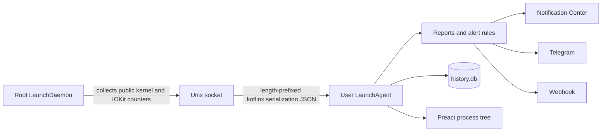

# Harmon

Harmon is a lightweight macOS workload monitor written in Kotlin/Native. It
samples processes every few minutes, groups helpers into their owning
application, explains memory and storage pressure, and can notify Notification
Center, Telegram, or an HTTPS webhook.

It runs as two launchd services and exposes a private, loopback-only process UI
from the user agent:



The privileged collector never loads user configuration or notification
credentials. The user agent never calls the process-inspection APIs directly.
They are different native executables: `harmon-collector` links only collection
and IPC code, while `harmon` owns the agent, CLI, notifications, HTTP, and
SQLite history.

See [the product intent](docs/INTENT.md) for the principles behind those choices,
[the collection model](docs/collection.md) for metric definitions,
[the service architecture](docs/architecture.md) for the privilege and IPC
boundary, and [the sample history](docs/history.md) for the schema the stored
samples are queried through.

## Quick start

Harmon needs an Apple Silicon Mac running macOS 12 Monterey or newer.

### Install

```shell
brew install Heapy/tap/harmon
harmon setup
harmon status
```

Homebrew installs the CLI and the paired collector binary. `setup` deploys them
to the launchd locations Homebrew cannot write to and registers both services;
`status` verifies them and needs no sudo. Run `harmon setup` again after every
`brew upgrade harmon` — Homebrew replaces its own copies but cannot use sudo
to update the root helper or the user app bundle, and `status` exits 1 while
those are stale. The [Homebrew section](#install-with-homebrew) covers the
details; a [source build](#install-a-source-build-with-launchd) is the
alternative to the tap.

### Uninstall

The order matters:

```shell
harmon uninstall
brew uninstall harmon
```

`harmon uninstall` stops both services and removes the LaunchAgent, the app
bundle, the LaunchDaemon, the root helper, and the socket; it runs as the login
user and requests sudo once. `brew uninstall` then removes the Cellar copy.

A Homebrew formula has no uninstall hook, so `brew uninstall harmon` on its own
deletes nothing outside the Cellar: both launchd services keep running from
their deployed copies, including the root collector, with no `harmon` left on
`PATH`. Recover by running the deployed agent binary directly:

```shell
"$HOME/Library/Application Support/Harmon/Harmon.app/Contents/MacOS/harmon" \
  uninstall
```

Configuration, logs, generated reports, and the sample history are preserved. To
leave nothing behind instead, add `--purge`:

```shell
harmon uninstall --purge
brew uninstall harmon
```

`--purge` additionally removes `~/.config/harmon`, `~/Library/Logs/Harmon`,
`/Library/Logs/Harmon`, and the whole `~/Library/Application Support/Harmon`
tree — the history database with its WAL and SHM sidecars, the generated
reports, and the app bundle. It prints every path before removing any of it and
never prompts, so it stays usable in scripts. Nothing is deleted until the sudo
phase succeeds: a declined password leaves all data intact. It is idempotent, so
it also works after a plain `harmon uninstall`.

## What Harmon monitors

- per-process and per-application CPU over the real sampling window;
- resident, wired, physical-footprint, and lifetime-peak memory;
- a bounded per-process compressed-or-paged-out memory proxy;
- global allocated/used swap, physical compressor size, uncompressed memory
  represented in the compressor and in swap, compression/decompression rates,
  and compressor swap-I/O rates;
- physical disk reads and writes, logical writes, page-ins, faults, system
  calls, context switches, thread counts, instructions, cycles, and accounted
  energy where macOS supplies it;
- internal block-device bytes, operations, and service time from IOKit;
- root-filesystem capacity;
- system CPU, 1/5/15-minute load averages, physical memory, and power state;
- automatic `.app` grouping, including Firefox, Chromium, Electron, and other
  multi-process applications, with the terminals listed in
  `terminalApplications` treated as boundaries rather than owners of every
  command they launch;
- alerts on crossing a threshold for CPU, memory, physical storage writes, swap
  usage, swap-out traffic, likely battery drain — accounted watts where macOS's
  energy counter reports, the heuristic score where it does not — and low
  battery;
- an alert on a process losing its parent: a process that had a live parent in
  one sample and is handed to launchd by the next raises a warning naming both,
  which no snapshot of `ps` can tell apart from an ordinary daemon.

All local IPC and outbound JSON is encoded with `kotlinx.serialization`.
Executable paths and detailed collection failures remain local and are omitted
from normal webhook payloads.

## Important interpretation limits

### Per-process swap

macOS exposes supported global swap state, but it does not expose a supported
public `PID → bytes physically present in swap files` table. Harmon therefore
keeps three concepts separate:

- `swap.usedBytes`, from `vm.swapusage`, is the global amount of used swap
  space;
- `virtualMemory.swapBackedUncompressedBytes` is the uncompressed size of VM
  pages represented by compressor slots currently on disk. It is deliberately
  not labelled physical swap bytes and can be larger than `swap.usedBytes`;
- `compressedOrPagedOutBytes` is a per-process proxy obtained by walking public
  VM region information. It counts pages owned by the compressor pager and
  cannot distinguish pages still held in compressed RAM from pages whose
  compressor segment was written to disk.

To keep collection bounded, Harmon walks VM regions only for the 256 readable
processes with the largest physical footprint, and stops walking once a
per-sample budget of 100,000 regions is spent. Most of that budget goes to the
largest processes first — they are what the compressed-memory ranking is made
of, and a share too small to finish one produces nothing — and the reserved
remainder is split over the rest of the candidates. On a loaded machine the
budget, rather than the 256-process limit, is what ends attribution: the head of
the ranking is measured completely and most of the tail is truncated, so a
minority of the 256 candidates yields a value. Reports include the attribution
coverage and failure count; see [the collection model](docs/collection.md) for
the measured coverage figures. The proxy must not be summed and presented as
exact disk swap.

### Root access

Running the collector as root fixes the normal same-user restriction applied
by `proc_pid_rusage` and `proc_pidinfo`, so it substantially improves process
coverage. It does not disable SIP, mandatory access-control policy, or every
special protection used by macOS. Harmon keeps an inaccessible-process count
and detailed local diagnostics instead of silently treating missing processes
as zero usage.

### Battery impact

Activity Monitor's `Energy Impact` formula is private. Harmon exports macOS's
accounted nanojoule counter when available and also calculates a transparent
relative score:

```text
CPU % + wakeups/s × 0.25 + physical disk I/O MiB/s × 2
```

The score is not a wattmeter, and where the accounted counter reports it is no
longer what Harmon alerts on, nor what the text report ranks by; the JSON
payload keeps both rankings with their own sorts. Which of the two leads is
decided once per sample rather than per application: any process reading above
zero watts makes the whole sample accounted. The battery-impact table names the
regime in its heading — `(accounted power)` or `(heuristic score)` — and the
JSON payload carries `energyAccounted` for the same reason. The score is still
calculated for every sample, carried in the JSON payload and stored in
`history.db` either way; on a machine whose counter reads zero it remains the
only battery signal there is. Its wakeup weight is 5 to 12.5 times heavier than
the published reconstructions of Apple's own formula, and its I/O term has no
established Apple analogue at all; see
[the collection model](docs/collection.md) for that comparison.

## Upgrading from an earlier build

This release corrects CPU accounting in the native bridge. `proc_pid_rusage`
returns CPU time in mach absolute time, and Harmon reported those ticks as if
they were nanoseconds. On Apple Silicon one tick is 125/3 ns, so every
per-process and per-application CPU percentage, and every battery-impact score
derived from CPU, is now about 41.7 times higher than the value Harmon printed
before: the old numbers were understated by that factor. Intel Macs have a 1:1
timebase and are unaffected.

Thresholds tuned against the old numbers must be retuned.
`applicationCpuAlertPercent` and `applicationBatteryImpactAlertScore` lowered
to compensate for the understated values now fire on almost every sample; the
same keys left at a level the old numbers could never reach begin alerting for
the first time. `applicationBatteryImpactAlertScore` is worth retuning only for
a machine whose energy counter reads zero: where it reports, that key is not
consulted at all and `applicationPowerAlertWatts` governs battery-drain alerts
instead.

The collector protocol is now version 3. Version 2 introduced the corrected CPU
counter units; version 3 adds a strict `HELLO → PROBE|CAPTURE(profile) →
ACK|SNAPSHOT(appliedProfile)` exchange. Probe performs no collection, and the
two accepted profiles are `FULL` and `LIVE_FAST`. The collector (root
LaunchDaemon) and agent (user LaunchAgent) remain a matched pair and must be
reinstalled together with `harmon setup`; a v2/v3 mismatch fails explicitly.

## Requirements

- Apple Silicon Mac running macOS 12 Monterey or newer.

A source build additionally needs Xcode Command Line Tools or Xcode and Kotlin
Toolchain 0.11.1 through the checked-in `./kotlin` wrapper. The toolchain
resolves Kotlin 2.4.10.

## Build and test

```shell
./kotlin build
./kotlin build --variant release
./kotlin test
```

Build before test. The test run drives the C bridge harness and `selftest`, then
the Kotlin/JVM Playwright suite spawns the native `webuicheck` fixture. Both
native executables are produced only by `./kotlin build`; a missing or stale
fixture fails rather than being skipped. Run only the browser suite with:

```shell
./kotlin test -m webuitest
HARMON_WEBUITEST_HEADED=1 ./kotlin test -m webuitest
```

Playwright supplies its Node driver; the project has no npm install or frontend
build step.

The C harness can also be run on its own — it needs no Kotlin build, since the
script compiles it every time — with an optional name prefix to select one
suite:

```shell
scripts/test-native.sh
scripts/test-native.sh socket.
```

Neither harness is meant to run as root; two of the checks assume an ordinary
user. [`docs/native-testing.md`](docs/native-testing.md) describes both
harnesses in full.

The release executables are written to:

```text
build/tasks/_harmon_linkMacosArm64Release/harmon.kexe
build/tasks/_harmon-collector_linkMacosArm64Release/harmon-collector.kexe
```

The `_harmon_` in that path is the name of the checkout *directory*: the root
module has no `name:` key, so a clone or a git worktree under a different
directory produces `build/tasks/_<directory>_linkMacosArm64Release/` instead.
The collector is a physical `harmon-collector/` module, so its task directory
and output name stay stable. The same Debug/Release suffix convention applies
to the paths below.

For a local, unprivileged IPC smoke test without installing launchd services,
start the collector in one terminal:

```shell
build/tasks/_harmon-collector_linkMacosArm64Debug/harmon-collector.kexe \
  --socket /tmp/harmon-dev.sock \
  --allowed-uid "$(id -u)" \
  --allowed-gid "$(id -g)" \
  --allow-unprivileged
```

Then sample through it from another terminal:

```shell
HARMON_COLLECTOR_SOCKET=/tmp/harmon-dev.sock \
  build/tasks/_harmon_linkMacosArm64Debug/harmon.kexe \
  once --sample-seconds 2
```

This development mode intentionally has the same visibility limitations as
the current login user.

## Commands

```text
harmon-collector --allowed-uid UID --allowed-gid GID [--socket PATH]
harmon run [--config PATH]
harmon once [--config PATH] [--sample-seconds N] [--notify]
harmon diagnose [--config PATH] [--sample-seconds N]
harmon check-config [--config PATH]
harmon test-notifications [--config PATH]
harmon setup
harmon setup --system --uid UID --gid GID
harmon status
harmon ui
harmon uninstall [--purge]
harmon uninstall --system --uid UID [--purge]
harmon --help
harmon --version
```

launchd owns `harmon-collector` in a normal installation; it is not a `harmon`
subcommand. With no command, `harmon` starts the user-agent loop. `once` takes
two collector snapshots and prints one report. `diagnose` also prints grouping,
attribution coverage, and process-access failures.

`harmon ui` opens the authenticated local process monitor published by the
running user agent. The page is an htop-like PID tree, not an application-group
view: every additive metric has independently sortable Self and descendant
Total values. PID and Process are pinned, Overview is the default preset, and
CPU Total descending is the default sort. Memory, I/O, Activity, and Compute /
Energy presets expose footprint/resident/wired/compressed memory, disk and page
activity, wakeups/faults/syscalls/threads, and instructions/cycles/power.
Lifetime peak is self-only. Known partial totals remain sortable and badged;
unavailable values stay below available ones. Search accepts process names and
PIDs, keeps matching ancestors visible, and includes a matched process's
subtree. Roots and their first child level start expanded. Expandable system
details and the full text report remain below the tree.

The live sampler stays idle until at least one visible tab is in Live mode. Its
header-authenticated `watch=1` polling renews a shared lease of
`max(5 seconds, 3 × webSampleSeconds)`; hidden, closed, and Snapshot tabs stop
renewing it. The first capture after idle is a new `FULL` baseline, cadence
captures are `LIVE_FAST`, and `FULL` attribution is refreshed at most once per
30 seconds. A capture overrun schedules the first future cadence tick, so missed
slots never queue or run as catch-up work. Fast captures retain every metric
except the VM-region walk and overlay cached attribution by PID plus start time.
The UI dates the global Last FULL measured/failed pair separately from each
application's coverage of current members with cached values. This baseline
remains independent of alert/history sampling and `intervalSeconds`. Snapshot
freezes the current browser view, and Resume starts renewing the lease again.
Column selection, sorting, search, and tree expansion survive live updates and
WARMING/STALE transitions.

The server chooses a fresh loopback port and 256-bit token on every start.
`harmon ui` opens `http://127.0.0.1:<port>/#token=<token>` from the user-only
`~/Library/Application Support/Harmon/live-ui.endpoint`. The fragment never
enters an HTTP target or referrer. Live bootstrap validates it, stores it in
that port's `sessionStorage`, and replaces the displayed URL with `/` before the
first fetch. Subsequent relative `/api/live?watch=1` requests carry one Bearer
header; query strings, cookies, the DOM, logs, and the displayed URL carry no
secret. Reload in the same tab reuses the session token, while a missing/stale
token or blocked storage/history shows `run harmon ui again` without renewing
the sampling lease. Saved Snapshot pages remain self-contained and perform no
storage access or network fetch. The Web UI payload schema remains version 2.

`--sample-seconds` is the gap between those two snapshots and accepts 1 to 300
seconds inclusive. A value outside that range, or one that is not an integer,
is rejected with exit status 2; the same bounds apply to the
`onceSampleSeconds` configuration key.

## Configuration

Harmon reads `~/.config/harmon/config`. The installer creates it from
[config/harmon.conf.example](config/harmon.conf.example) without overwriting an
existing file.

Important defaults:

```properties
collectorSocket=/var/run/harmon.collector.sock
intervalSeconds=300
webUiEnabled=true
webSampleSeconds=1
historyRetentionDays=7
orphanAlerts=true
applicationCpuAlertPercent=150
applicationMemoryAlertMiB=2048
applicationDiskWriteAlertMiBPerSecond=50
swapAlertMiB=1024
swapOutAlertMiBPerSecond=25
applicationBatteryImpactAlertScore=100
applicationPowerAlertWatts=1.5
batteryLowAlertPercent=20
systemNotifications=true
notifyEverySample=false
```

`webSampleSeconds` accepts 1 through 10. It is the fast Live cadence, not a
background polling interval: with no visible Live tab, the collector is not
called. `webUiEnabled=false` disables only the loopback server and its
demand-driven sampler; alerting, notifications, and history continue normally.

A threshold of `0` disables that rule. `orphanAlerts` is the one alert rule
without a threshold — losing a parent is an event, not a quantity, so there is
no number to lower until it stops matching — and `orphanAlerts=false` is how it
is switched off. It is on by default and fires at most `maxAlertsPerCategory`
times per sample, like every other rule. It switches off the alert and nothing
else: `harmon run` still records the transition in the history database, in
`process.reparented_at`. `applicationMemoryAlertMiB` and
`swapAlertMiB` are capped at 1,048,576 MiB (1 TiB); a larger value is rejected
and the process exits with status 2. `terminalApplications` is a
comma-separated list of bundle names without `.app`, matched case-insensitively.
It replaces the built-in list outright — that list is spelled out in
[config/harmon.conf.example](config/harmon.conf.example) — and an empty value
turns the terminal boundary off. The old
`processCpuAlertPercent`, `processMemoryAlertMiB`, and
`batteryImpactAlertScore` keys remain accepted as compatibility aliases.
`alertCooldownSeconds` no longer does anything — alerts are pushed when a
threshold is crossed rather than on a timer — but the key is still accepted and
reported on stderr instead of failing the config.

`applicationPowerAlertWatts` and `applicationBatteryImpactAlertScore` are two
thresholds for one rule, and only one of them is read per sample. Where macOS's
energy counter reports, the watt threshold decides and the score threshold is
not consulted at all; where the counter reads zero, the score decides exactly as
before. That changes the behaviour of configurations written before this
release: on a machine with a working counter a tuned
`applicationBatteryImpactAlertScore` stops firing and the 1.5 W default takes
over. Neither key falls back to the other, so `applicationPowerAlertWatts=0`
silences battery-drain alerts on such a machine rather than handing the rule
back to the score.

Notification destinations can be overridden for manual runs:

```text
HARMON_WEBHOOK_URL
HARMON_WEBHOOK_BEARER_TOKEN
HARMON_TELEGRAM_BOT_TOKEN
HARMON_TELEGRAM_CHAT_ID
HARMON_COLLECTOR_SOCKET
```

External webhooks must use HTTPS. Plain HTTP is accepted only for `127.0.0.1`,
and the host is read from after any `@` in the URL, so
`http://127.0.0.1@example.com/hook` is an external HTTP URL and is rejected
rather than treated as loopback. A LaunchAgent does not inherit terminal
environment variables, so
normal installations should keep secrets in the generated `0600` config file.

Validate configuration and notification delivery without printing secrets:

```shell
harmon check-config
harmon test-notifications
```

## Alerts and notifications

Alerts are event-driven. A push goes out when an alert key crosses its
threshold; while the condition keeps holding there are no repeat reminders. Once
the value clears, the same alert pushes again the next time it fires. To stop a
value sitting on the threshold from flapping, an alert that is already firing
clears only after it drops below 90% of the threshold. Low battery is exempt: it
is the one rule comparing with "less than or equal", where a lowered bound would
drop the alert while the battery is still low.

A key counts as pushed only once a channel confirmed it. Notification Center is
best-effort — macOS gives the launchd agent no synchronous delivery
confirmation — so its optimistic success is discounted whenever a decisive
channel, a webhook or Telegram, is configured: then only that channel settles an
alert. With Notification Center as the only channel there is nothing to discount
it against, so its success does settle the alert; otherwise such an install
could never settle anything. A failure it does report, such as being unable to
write the HTML report, is an observation either way and keeps the alert
pushable. A sample whose webhook and Telegram calls both failed is retried on
the next sample instead of being silently dropped. An alert whose condition
still holds is never given up on, but after three consecutive failed deliveries
its retries widen from two samples up to thirty-two, so a permanently broken
channel cannot turn Notification Center into an endless banner loop. Any
confirmed delivery clears that backoff at once. Alert state is stored in the
history database and resumed on restart, so an alert that never stopped firing
is not pushed a second time and a failing channel keeps the backoff it earned.
A stored state older than two sampling intervals is dropped rather than
resumed: it describes a machine that has since moved on. So is one the database
refuses to hand back: the failure is logged and the agent starts empty, because
a damaged record of yesterday's monitoring must not cost today's. With history
turned off the agent starts from an empty state every time, as it did before.

The push text names only the alerts that fired on this sample. The attached HTML
report and the JSON webhook payload both carry the sample's whole reported alert
list, and the payload adds `newAlertKeys` listing the ones the push was about.
That list is capped at `maxAlertsPerCategory` alerts per rule, and
`suppressedAlertKeys` names every key the cap left out — over its threshold for
the rules that have one, matching at all for the orphan rule, which has none —
so a consumer diffing the alert list can tell a dropped alert from a cleared one
and the count is the whole overflow. An already-firing alert pushed out of the
top slice is demoted rather than cleared — it stays in the alert state, so its
return to the list does not push again — while a key crossing its threshold
below the cut is reported as suppressed without entering that state.

One rule sits outside all of that. The orphan alert fires on a transition — a
process that had a live parent in the previous sample and has pid 1 as its
parent in this one — and a transition exists for exactly one sample. Everything
above works by carrying a key from one sample to the next and rebuilding the
push from the alert list of the later one, and for this rule there is nothing to
rebuild from: the next sample has no such alert, and even the message could not
be reassembled, because the dead parent's name was read from the sample it was
still alive in. So delivery is one-shot. A failed push of an orphan alert is not
retried, and an orphan pushed out of the per-category slice is not demoted but
dropped — unlike an application alert it gets no later sample to return on.

Neither case loses the fact, though what is left of it differs. A suppressed
orphan is in the report text, in the webhook payload and in the `alert` table
with `reported = 0`. A failed push is in the report text and the `alert` table
only — the payload is exactly what did not arrive. Both are stamped in
`process.reparented_at` in the history database, which keeps the transition for
as long as retention keeps the process: once the last sample naming it leaves
the window, the row goes with it. Transitions that happen while the agent is not
running are not seen at all, since the sample they would have been compared
against was never taken.

With `notifyEverySample=true` the agent sends on every sample and treats the
whole alert list as push content; nothing is deferred in that mode, so
`newAlertKeys` there names every alert not yet confirmed as delivered, including
one whose earlier deliveries failed.

Edge detection across samples exists only in the long-running `harmon run`
agent. `harmon once --notify` starts with a fresh, empty alert state, so every
alert active in its single sample counts as new: all of them are pushed, and
`newAlertKeys` lists all of them. `once` and `diagnose` do compare two
snapshots, so the orphan rule can match there, but their window is seconds
rather than five minutes and a process that daemonizes inside it looks exactly
like one that lost its parent. Neither command writes history, so nothing is
stored — but `once --notify` does deliver, and a false orphan raised under it
reaches the webhook, Telegram and Notification Center like any other alert.
`orphanAlerts=false` is the way out for an installation that runs it often.

Notification Center delivery uses the background-only Harmon application
bundle installed under `~/Library/Application Support/Harmon/Harmon.app`.
Each system notification atomically updates a private local report at
`~/Library/Application Support/Harmon/Reports/latest.html`. Clicking the
notification opens that complete report in the default browser. No remote
resources are fetched: the snapshot contains the same pinned Preact 10.29.1
tree UI as the live page and a raw-text `<noscript>` fallback. Script Editor is
not involved.
The launchd agent uses the compatible Notification Center path because current
macOS releases reject the modern UserNotifications API from a launchd job.

## History

A report describes the sample it was built from and nothing else, so `harmon
run` also writes every sample to a SQLite database at
`~/Library/Application Support/Harmon/history.db`: the system counters, every
process, every application that has a bundle, the alerts, and what each channel
did with them. That is what makes "what was eating the machine at three in the
morning" a question with an answer.

`historyRetentionDays` is how far back the answer goes. At the default of seven
days and a 300-second interval expect a couple of hundred megabytes — a measured
sample costs about 140 bytes per stored process, and a machine with several
hundred readable processes writes around 222 000 of those rows a day. That is an
extrapolation from one measured window rather than an observed steady state, so
treat it as an order of magnitude. A `0` keeps no history at all and creates no
database file. The agent prunes the window about once an hour and hands the
freed space back to the file system as it goes, up to 8 MiB per pass.

Only `harmon run` writes. `once` and `diagnose` measure a window of seconds
instead of the sampling interval, so their numbers would mean something
different inside the same series. Harmon itself reads the database only for the
alert state it resumes after a restart; everything else is a `sqlite3` query
against a schema that is meant to be queried by hand. That schema, with the
queries worth starting from, is [the sample history](docs/history.md).

## Install with Homebrew

The formula is maintained in the
[Heapy Homebrew tap](https://github.com/Heapy/homebrew-tap). The normal
installation and upgrade flow is:

```shell
brew install Heapy/tap/harmon
harmon setup
harmon status
```

Run `harmon setup` again after every `brew upgrade harmon`, then verify with
`harmon status`. Homebrew updates the paired source binaries in its Cellar, but
cannot use sudo to replace the root helper or update the user app bundle.
`status` reports those stale copies explicitly.

An installation made by the former source script may still have
`~/.local/bin/harmon` earlier in `PATH`. For that one migration run, invoke the
new Homebrew binary explicitly:

```shell
"$(brew --prefix)/bin/harmon" setup
"$(brew --prefix)/bin/harmon" status
```

Setup removes only the former installer's managed symlink; an unrelated file or
symlink at that path is preserved.

The formula installs a ready-made arm64 archive; it does not need the Kotlin
toolchain. It intentionally has no Homebrew service: the source collector is
copied by setup to the root-owned
`/Library/PrivilegedHelperTools/harmon-collector` before launchd can execute it.
Release and tap handoff instructions are in
[docs/releasing.md](docs/releasing.md).

## Install a source build with launchd

Build the paired release binaries, then run `setup` as the login user:

```shell
./kotlin build --variant release
build/tasks/_harmon_linkMacosArm64Release/harmon.kexe setup
```

`scripts/install.sh` remains as a compatibility shortcut that performs exactly
those two commands. All installation behavior lives in `harmon setup`; the
script does not generate plist files or call launchctl itself.

Setup first creates the application bundle, config, logs, and LaunchAgent as the
login user. It then re-executes the same resolved binary once through sudo for
the root-owned helper, LaunchDaemon, and service bootstrap. It:

- installs the background-only agent bundle under
  `~/Library/Application Support/Harmon/Harmon.app`;
- installs `harmon-collector` at the root-owned
  `/Library/PrivilegedHelperTools/harmon-collector` path;
- registers `dev.yoda.harmon.collector` as a system LaunchDaemon;
- creates `/var/run/harmon.collector.sock`, accessible only to root and the
  configured login user;
- registers `dev.yoda.harmon.agent` in the Aqua user session;
- preserves an existing user configuration.

An old `~/.local/bin/harmon` symlink managed by the former installer is removed
so it cannot shadow an upgraded Homebrew binary. An unrelated file or symlink at
that path is left alone. The former agent Label, plist, and helper path are
cleaned up during the same migration.

After setup, and after every source binary upgrade, run:

```shell
harmon status
```

It is read-only and needs no sudo. The report shows the running CLI and paired
source collector versions, the copies in `Harmon.app` and
`/Library/PrivilegedHelperTools`, expected and live protocol versions, socket
health, and both launchd jobs with their PID, executable path, and persistent
enablement. A pair disabled by `harmon stop` is reported as intentionally
stopped and still exits 1 because monitoring is not running. Any stale, mixed,
unexpectedly unloaded, or failed state also exits 1 and says to run
`harmon setup`.

Inspect services and logs:

```shell
launchctl print "gui/$(id -u)/dev.yoda.harmon.agent"
sudo launchctl print system/dev.yoda.harmon.collector
tail -f ~/Library/Logs/Harmon/agent.log
sudo tail -f /Library/Logs/Harmon/collector.log
```

Stop both services and keep them disabled across login and reboot, without
removing the installation or any user data:

```shell
harmon stop
```

The command removes the live UI endpoint and requests sudo once for the root
collector. `harmon status` then reports that Harmon is intentionally stopped;
run `harmon setup` to enable and start both services again.

Remove both services and installed binaries while preserving configuration,
logs, generated reports and the sample history:

```shell
harmon uninstall
```

The command runs as the login user, removes the LaunchAgents and app bundle,
then requests sudo once to remove the LaunchDaemon, root helper, legacy helper,
and socket. A Homebrew install itself remains in the Cellar; run
`brew uninstall harmon` afterwards if the CLI should be removed too.
`scripts/uninstall.sh` is retained only as a source-checkout compatibility
shortcut: like `scripts/install.sh`, it builds the release binary and delegates
all behavior to the typed CLI command. It passes no flags, so `--purge` is
available through the CLI rather than the script.

The history database is the largest of the preserved files — it is the record
the agent was collecting, and up to a few hundred megabytes of it. Remove it,
and everything else Harmon wrote, with:

```shell
harmon uninstall --purge
```

It removes `~/.config/harmon`, `~/Library/Logs/Harmon`, `/Library/Logs/Harmon`,
and the whole `~/Library/Application Support/Harmon` tree. The tree is removed
whole rather than file by file because the WAL and SHM sidecars of `history.db`
and the report temporaries are named nowhere in the code, so no explicit list
could be complete. Every path is printed before anything is deleted, and nothing
is deleted until the privileged phase returns, so a declined sudo password
leaves the data intact. The `--system` form purges only the root-owned log
directory. Purging is idempotent and can be run after a plain
`harmon uninstall`.

If both `harmon uninstall` and `brew uninstall harmon` already ran, there is no
CLI left to purge with; reclaim the database directly:

```shell
rm -f ~/Library/Application\ Support/Harmon/history.db*
```

## Project structure

```text
core/          shared model, protocol, policy, config, reports, and agent runtime
history-sqlite/
               SQLDelight history implementation, schema, retention, and tests
harmon-collector/
               collector app, IPC server, Darwin probes, and collector tests
src/           harmon CLI, IPC client, notifications, and app composition root
bridge-ipc/    Unix sockets and JSON framing cinterop
bridge-install/
               executable-path discovery used by setup and status
bridge-probe/  libproc, Mach, sysctl, and IOKit cinterop
bridge-http/   libcurl cinterop
plugins/       the SQLDelight code generator, as a Toolchain plugin
selftest/      probe binding checks run from Kotlin
test/          root CLI/factory/harness tests, plus the C harness in test/native
launchd/       Harmon.app metadata and icon
scripts/       compatibility install/uninstall entry points, release tools, and C tests
docs/          architecture, metric semantics, and the history schema
third_party/   licenses for source-vendored dependencies
LICENSE        GPL-3.0-only license text
```

## License

Harmon is licensed under the
[GNU General Public License version 3 only](LICENSE) (`GPL-3.0-only`).
The embedded Preact module remains under its
[MIT license](third_party/preact/LICENSE), which is also shipped as
`share/harmon/PREACT-LICENSE` in release archives.
