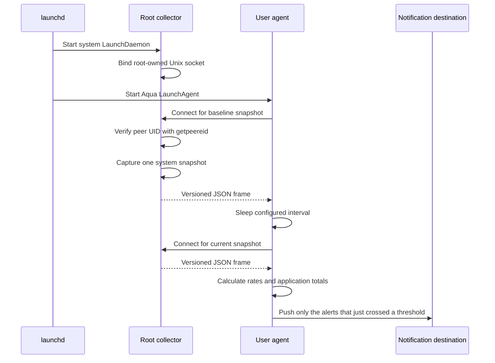

# Service architecture

Harmon separates privileged collection from user-session behavior. This keeps
root access out of Notification Center, Telegram, webhooks, and future UI code.

## Components

| Component | launchd domain | Effective user | Responsibilities |
|---|---|---:|---|
| Collector | system LaunchDaemon | root | Read process, VM, swap, CPU, storage, and power counters; serve snapshots |
| Agent | Aqua LaunchAgent | login user | Schedule samples, calculate deltas, group applications, evaluate rules, log, notify, and store history |
| CLI | interactive user process | caller | Run one-shot reports, diagnostics, config checks, and notification tests |

The release currently contains all roles in one Kotlin/Native executable.
Installation places a root-owned copy under `/Library/PrivilegedHelperTools`
and a signed, background-only user application bundle under
`~/Library/Application Support/Harmon/Harmon.app`; `~/.local/bin/harmon`
links to that bundled executable. The bundle gives Notification Center a
stable Harmon identity and routes notification clicks back to the running
agent. Command dispatch occurs before user configuration is loaded, so the
collector does not read notification secrets or initiate network delivery.

The icon shown next to a notification is the bundle's own icon: `Info.plist`
names `Harmon.icns` through `CFBundleIconFile`, and the installer copies that
resource in before signing, since a resource added to a signed bundle
invalidates the signature. Notification Center and LaunchServices both cache
the icon per bundle identifier, so the installer re-registers the bundle and
restarts `usernoted` — an icon replaced without that still shows up as the
previous one. IconServices keeps a third copy, which survives both; when a
*replaced* icon keeps rendering as the old one, clear it by hand:

```shell
rm -rf ~/Library/Caches/com.apple.iconservices.store
killall iconservicesagent iconservicesd
```

`scripts/make-icon.sh` regenerates `Harmon.icns` from `logo.png`.

## Request lifecycle



The collector is request-driven rather than continuously polling. One accepted
connection produces one snapshot. The agent determines the interval and needs
two snapshots to calculate rates. It sleeps on the monotonic clock, parked for
the whole interval rather than polling, so a wall-clock adjustment cannot
stretch or collapse a sampling window.

Notification is edge-triggered, not scheduled. The agent keeps the set of alert
keys that were firing on the previous sample and the set whose delivery was
confirmed; a push is built from the keys missing from the latter. The attached
report and the JSON payload still describe the whole sample.

## Sample history

The SQLite database lives on the agent side, at
`~/Library/Application Support/Harmon/history.db`. It is the agent that keeps
it because the collector is the root half of the split, and a component running
as root gains nothing here that would justify giving it the ability to write to
a user file. The collector serves snapshots and remains request-driven.

The directory, not the file, carries the `0700` mode: sqlite recreates
`history.db-wal` and `history.db-shm` beside the database on every open, both
carry the same telemetry, and a mode set on them would not survive. The
connection runs in WAL with `synchronous=NORMAL`, which trades the last sample
in a kernel panic for not fsyncing on a 300-second interval, and with
`auto_vacuum=INCREMENTAL`, which is what lets retention return space to the
file system without a full `VACUUM`.

Each sample is one transaction: the system row, every process, every
application group that has a bundle, the alerts, the delivery results, and the
alert state the next sample starts from. Groups without a bundle are left out
on purpose — `ApplicationGrouper` gives every such process a group of its own,
and writing it would duplicate the process row it already wrote, line for line,
several hundred times a sample.

History is an addition to monitoring rather than a precondition for it. A
database that cannot be opened costs the run its history and is reported once;
a sample that cannot be written is rolled back whole and reported once until a
write succeeds again, because sqliter prints a stack trace of its own before it
throws and a full disk would otherwise fill the launchd log once per interval.

## IPC protocol

The default endpoint is `/var/run/harmon.collector.sock`. It lives directly in
the boot-managed `/var/run` directory, so the collector does not depend on a
custom runtime directory surviving a restart.

Each response is:

1. a four-byte unsigned payload length in network byte order;
2. one UTF-8 JSON document of exactly that length;
3. connection close.

The frame limit is 32 MiB. Socket send and receive operations have 30-second
timeouts. JSON is generated and parsed with `kotlinx.serialization`; the
envelope contains a protocol version and a `RawSystemSnapshot`. Unknown fields
are rejected so a version mismatch fails explicitly instead of silently
changing metric meaning.

The current version is 2. It was raised from 1 when the CPU counters changed
units: `userTimeNs` and `systemTimeNs` used to carry raw mach absolute ticks
under a nanosecond name, and the collector now converts them to real
nanoseconds. The agent refuses a snapshot from any other version with
`Unsupported collector protocol 1; expected 2` rather than deriving CPU
percentages from ticks. Collector and agent are therefore a matched pair and
have to be upgraded together.

No request body or mutation command exists. Connecting only asks for a fresh
snapshot.

## Local authorization

The installer records the login user's numeric UID and primary GID in the
LaunchDaemon plist.

- the socket directory is root-owned;
- the socket is created with mode `0660`;
- the collector assigns the configured primary group;
- every accepted connection is checked with `getpeereid`;
- only the configured UID and root are accepted;
- the client also checks the connected server's peer UID and accepts only root
  (or its own UID for explicit local development mode).

File mode is therefore only the first check. A different local account that
shares a group is still rejected by peer UID.

The installer passes `--allowed-gid "$(id -g)"`, which on a stock macOS install
is `staff` — the primary group of every local account — so on a multi-account
machine every user can reach the socket and be rejected there. Point
`--allowed-gid` at a dedicated group if that matters. The rejection is cheap
either way: it takes no snapshot, does not count against the accept-failure
budget, and its log line is coalesced to at most one a minute, so a rejected
peer connecting in a loop cannot fill the collector's log.

The collector refuses to start without root unless the explicit
`--allow-unprivileged` development switch is supplied. Development mode is
intended only for a socket under `/tmp` and does not improve process access.

## Failure behavior

- A failed collector startup exits; launchd throttles and restarts it.
- A rejected peer is closed without taking a snapshot, and a rejection never
  counts against the accept-failure budget. Its log line is coalesced into at
  most one a minute, each naming how many rejections it stands for.
- A failing `accept` is logged and retried after a short pause. Only 16
  consecutive failures end the daemon, so a transient error cannot kill it while
  one served client resets the count.
- A per-process access failure does not fail the snapshot. It is counted and,
  up to the diagnostic capacity, recorded with available PID metadata.
- Failure of required global swap, physical-memory, CPU, or VM collection
  aborts that request.
- Battery and internal-storage collection are optional. Their output is marked
  unavailable when the APIs do not produce data.
- If an agent capture fails, its previous valid snapshot remains the
  baseline. The next successful interval covers the full monotonic duration.
- An exception raised while handling a sample is logged and the loop continues.
  The baseline advances to the newer snapshot first, so one bad pair of
  snapshots is not replayed against every following capture.
- An alert key is recorded as pushed only after a channel confirms delivery.
  Notification Center is best-effort: its optimistic success is discounted only
  when a decisive channel is configured, so a sample whose webhook and Telegram
  calls both failed pushes the same alerts again on the next sample, while an
  install with no decisive channel settles on that optimistic success. A failure
  Notification Center reports counts either way and keeps the alert pushable. A
  still-firing alert is never dropped; after three consecutive failed deliveries
  its retries widen from two samples up to thirty-two, and any confirmed
  delivery clears that backoff. Alert state is written to history with each
  sample and resumed on restart, unless it is older than two sampling intervals
  or history is turned off, in which case the agent starts from an empty state.
- Reports carry at most `maxAlertsPerCategory` alerts per rule and name every
  key the cap left out in `suppressedAlertKeys`, so a dropped alert is
  distinguishable from a cleared one and the count is the whole overflow. The
  alert state keeps the already-firing ones among those keys, so a demoted alert
  does not push again on its return; a key crossing its threshold below the cut
  is reported as suppressed but stays out of the state, and so out of
  hysteresis.
- With `notifyEverySample`, the push goes out whether or not a key's retry is
  deferred, so nothing is deferred in that mode and `newAlertKeys` names every
  alert no channel has confirmed yet.
- Notifications never run in the collector and cannot terminate it.
- Before a system notification is posted, the agent atomically replaces the
  private `Reports/latest.html` file. The notification carries only that local
  path, and its default click action opens the file through macOS.
- macOS rejects the modern UserNotifications scheduling API from a launchd
  job. The agent therefore uses the launchd-compatible Notification Center
  fallback. A future foreground UI component can adopt the modern API.

## Privilege boundary and residual risk

Root is used to pass Darwin's same-user process-information policy. It is not a
promise of complete visibility: mandatory access-control hooks and platform
protections may still reject a PID.

The snapshot contains process names, UIDs, parent relationships, and executable
paths. This is sensitive local metadata. The socket must not be exposed beyond
the configured account. Standard webhook payloads deliberately omit executable
paths and detailed collection failures.

The root process currently links the same executable image as the user agent,
including notification and HTTP code, although its command path does not call
them. A future hardening step can split the build into distinct collector and
agent binaries without changing the versioned snapshot protocol.

## Future UI

A UI should run as the login user and consume the same agent-side
`SystemUsage`/`MonitoringReport` model. It should not gain root privileges.
Possible evolutions are:

- have the agent persist bounded time-series data for the UI;
- add a separate read-only user socket owned by the agent;
- keep the existing collector protocol private to the agent;
- version storage schemas independently from collector IPC.
