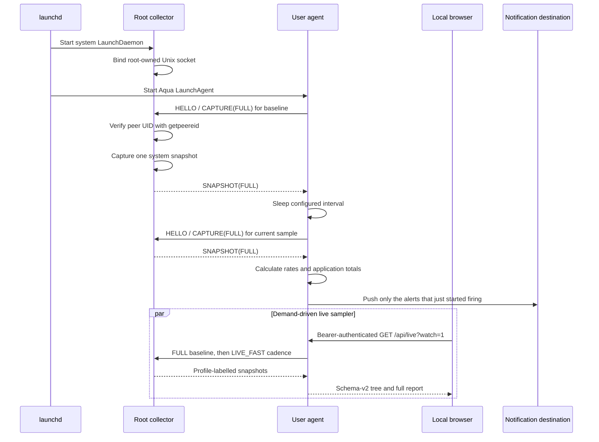

# Service architecture

Harmon separates privileged collection from user-session behavior. This keeps
root access out of Notification Center, Telegram, webhooks, and future UI code.

## Components

| Component | Binary | launchd domain | Effective user | Responsibilities |
|---|---|---|---:|---|
| Collector | `harmon-collector` | system LaunchDaemon | root | Read process, VM, swap, CPU, storage, and power counters; serve snapshots |
| Agent | `harmon` | Aqua LaunchAgent | login user | Schedule samples, calculate deltas, group applications, evaluate rules, log, notify, store history, and serve the local process UI |
| CLI | `harmon` | interactive user process | caller | Run one-shot reports, diagnostics, config checks and notification tests, or open the running UI |

The release contains two Kotlin/Native executables. Installation puts
`harmon-collector` under the root-owned
`/Library/PrivilegedHelperTools/harmon-collector` path and puts `harmon` in a
signed, background-only user application bundle under
`~/Library/Application Support/Harmon/Harmon.app`. The interactive CLI remains
the binary supplied by Homebrew or the build tree; setup removes only the
former installer's managed `~/.local/bin/harmon` symlink so it cannot shadow a
future upgrade. The bundle gives Notification Center a stable Harmon identity
and routes notification clicks back to the running agent.

This is a final-link boundary, not command dispatch inside one image:

- `harmon-collector` links `core`, `bridge-ipc`, and `bridge-probe`;
- `harmon` links `core`, `history-sqlite`, `bridge-ipc`, `bridge-http`, and
  the root-app-only `bridge-install` used to resolve its own executable;
- the collector image has no AppKit, libcurl, libsqlite3, notification code,
  history schema, SQLDelight runtime, CLI parser, or user configuration parser;
- Foundation remains in the collector because Kotlin/Native executables link
  it as a runtime baseline. `selftest.kexe` never imports Foundation and still
  has the same dependency, so its presence is not evidence that user-session
  code crossed the privilege boundary.

`otool -L` is the acceptance check for that boundary. The expected collector
frameworks are Foundation, CoreFoundation, and IOKit; AppKit, libcurl, and
libsqlite3 must be absent.

Application version, collector protocol version, and the minimum supported
macOS release come from `BuildInfo`. Both executable version commands read that
same object. Install-resource discovery reads `_NSGetExecutablePath`, resolves
the result through `realpath`, and then looks only beside that resolved binary:
`libexec/harmon-collector` and `share/harmon/` in an installed archive, or the
matching Debug/Release collector and source resources when running from
`build/tasks`. It contains no Homebrew prefix.

`harmon setup` has two privilege phases. The ordinary process creates every
path under the login user's home, signs and registers `Harmon.app`, preserves
the existing config while enforcing mode `0600`, and writes the LaunchAgent.
It signs with the first trusted code-signing identity reported by the system and
falls back to an ad-hoc signature when none is installed.
It then performs one exact sudo re-exec of its resolved binary with
`setup --system --uid N --gid M`. That root process writes only
`/Library/PrivilegedHelperTools`, `/Library/LaunchDaemons`, and
`/Library/Logs/Harmon`, then replaces both launchd jobs. The public `--system`
form supports automation that has already staged the user half.

Both launchd plists are encoded from typed `LaunchdJob` values, linted by
`plutil` while still temporary siblings of their targets, permissioned, and
atomically renamed. No text template or XML substitution remains.

`harmon status` is the read-only side of the upgrade contract. It compares the
running CLI and adjacent source collector with the copies in `Harmon.app` and
`/Library/PrivilegedHelperTools`, probes the socket's advertised protocol, and
parses `launchctl print` plus `print-disabled` for both jobs, including PID,
executable path, and persistent enablement. A pair that is explicitly disabled
and unloaded is reported as intentionally stopped; status skips the expected
dead socket probe, exits 1 because monitoring is not running, and names setup as
the restart path without presenting the stopped services as failures. A
Homebrew/source version newer than either installed copy, a mixed installed
pair, an old live protocol, a wrong program path, or any other unloaded,
disabled, or non-running job produces exit 1 and the explicit action
`Run 'harmon setup'`. Healthy versions, protocol, socket, and jobs produce exit
0. Status never invokes sudo or mutates a service.

`harmon stop` disables and unloads the user agent and root collector while
leaving their plists, deployed binaries, configuration, logs, reports, and
history in place. The login-user phase disables the current and legacy agent
labels before unloading them, then makes one sudo re-exec as
`stop --system --uid N`; the root phase applies the same operation to the
collector and both user labels. Disabling precedes unloading so launchd cannot
restart a keep-alive job during the transition. `harmon setup` explicitly
re-enables and starts both current jobs, and is therefore the restart path. The
user phase also removes the ephemeral live UI endpoint after unloading the
agent, so `harmon ui` does not have to discover and clean a stale endpoint.

The Homebrew formula is a distribution layer, not a service manager. A release
archive contains exactly `bin/harmon`, `libexec/harmon-collector`, and the three
resources under `share/harmon/`. Homebrew never builds Kotlin/Native, invokes
sudo, or declares a `service do` block. The collector in the Cellar is only a
setup source: the LaunchDaemon always executes the copied, root-owned
`/Library/PrivilegedHelperTools/harmon-collector`. The formula is generated
from `packaging/homebrew/Formula/harmon.rb.in` after the paired archive SHA-256
is known, then transferred to the separate tap repository. See
[`docs/releasing.md`](releasing.md).

`harmon uninstall` mirrors the privilege boundary and by default deletes no user
data. The login-user process unloads both current and legacy LaunchAgents,
removes their plists and the managed legacy `~/.local/bin/harmon` symlink, then
makes one sudo re-exec for the system LaunchDaemon, current and legacy helpers,
and socket. It keeps `Harmon.app` until that re-exec returns because the command
can itself be running from the old bundle; only then is the app removed. Config,
logs, reports, and `history.db` are preserved. The old install and uninstall
scripts are thin source-build compatibility entry points and contain no
installation or removal policy.

`--purge` keeps that same boundary and adds the user data. The login-user phase
prints every path it is about to remove, including the root-owned one, before
sudo can prompt; the root phase repeats its own path and removes
`/Library/Logs/Harmon`. The user phase then removes `~/.config/harmon`,
`~/Library/Logs/Harmon`, and the whole `~/Library/Application Support/Harmon`
tree — but only after the re-exec returns. Everything removed before that
point is recoverable with `harmon setup`; a purge is not, so a declined sudo
password must leave the data intact. Within the purge the support tree goes
last, because it is the one that can contain the running executable. It is
removed as a whole tree rather than as named files: `SetupFileSystem` cannot
enumerate a directory, and the WAL and SHM sidecars of `history.db` and the
report temporaries are named nowhere in the code, so any explicit list would be
incomplete by construction. Both phases are idempotent.

The icon shown next to a notification is the bundle's own icon: `Info.plist`
names `Harmon.icns` through `CFBundleIconFile`, and the installer copies that
resource in before signing, since a resource added to a signed bundle
invalidates the signature. Notification Center and LaunchServices both cache
the icon per bundle identifier, so the installer re-registers the bundle and
restarts `usernoted` — an icon replaced without that still shows up as the
previous one. IconServices keeps a third copy, which survives both; when a
*replaced* icon keeps rendering as the old one, clear it by hand:

```shell
rm -rf ~/Library/Caches/com.apple.iconservices.store
killall iconservicesagent iconservicesd
```

`scripts/make-icon.sh` regenerates `Harmon.icns` from `logo.png`.

## Request lifecycle



The collector is request-driven rather than continuously polling. One accepted
`CAPTURE` request produces one snapshot; `PROBE` produces none. The agent
determines the interval and needs two snapshots to calculate rates. It sleeps
on the monotonic clock, parked for the whole interval rather than polling, so a
wall-clock adjustment cannot stretch or collapse a sampling window.

Notification is edge-triggered, not scheduled. The agent keeps the set of alert
keys that were firing on the previous sample and the set whose delivery was
confirmed; a push is built from the keys missing from the latter. The attached
report and the JSON payload still describe the whole sample. Most rules fire on
a level crossing its threshold and go on firing while it holds; the orphan rule
fires on a transition that exists in one sample only, which is what makes its
delivery one-shot — see `docs/collection.md`.

## Sample history

The SQLite database lives on the agent side, at
`~/Library/Application Support/Harmon/history.db`. It is the agent that keeps
it because the collector is the root half of the split, and a component running
as root gains nothing here that would justify giving it the ability to write to
a user file. The collector serves snapshots and remains request-driven.

The directory, not the file, carries the `0700` mode: sqlite recreates
`history.db-wal` and `history.db-shm` beside the database on every open, both
carry the same telemetry, and a mode set on them would not survive. The
connection runs in WAL with `synchronous=NORMAL`, which trades the last sample
in a kernel panic for not fsyncing on a 300-second interval, and with
`auto_vacuum=INCREMENTAL`, which is what lets retention return space to the
file system without a full `VACUUM`.

Each sample is one transaction: the system row, every process, every
application group that has a bundle, the alerts, the delivery results, the alert
state the next sample starts from, and the `process.reparented_at` stamp for any
process the calculator saw handed to launchd in this sample. Groups without a
bundle are left out on purpose — `ApplicationGrouper` gives every such process a
group of its own, and writing it would duplicate the process row it already
wrote, line for line, several hundred times a sample.

History is an addition to monitoring rather than a precondition for it. A
database that cannot be opened costs the run its history and is reported once. A
database that opens and then refuses the first read — the alert state, read while
the agent is being constructed — costs that restore alone: the reason is logged
and the agent starts from an empty alert state, rather than dying before its
first sample and being restarted by launchd into the same death. A sample that
cannot be written is rolled back whole and reported once until a write succeeds
again, because sqliter prints a stack trace of its own before it throws and a
full disk would otherwise fill the launchd log once per interval.

## IPC protocol

The default endpoint is `/var/run/harmon.collector.sock`. It lives directly in
the boot-managed `/var/run` directory, so the collector does not depend on a
custom runtime directory surviving a restart.

Every protocol message is framed as:

1. a four-byte unsigned payload length in network byte order;
2. one UTF-8 JSON document of exactly that length.

The frame limit is 32 MiB. Socket send and receive options remain 30 seconds,
and the IPC bridge additionally applies one absolute monotonic deadline to the
whole frame, including both its length and body. Progress therefore cannot
restart the clock. Collector request frames have the tighter 4 KiB limit, and
the server shares one five-second deadline across its `HELLO` send and the
complete request receive. Snapshot responses retain the 32 MiB/30-second bound.
JSON is generated and parsed with `kotlinx.serialization`, with unknown fields
rejected in both directions. A version-3 connection is exactly:

1. collector sends `HELLO`;
2. agent sends either `PROBE` or `CAPTURE(profile)`;
3. collector sends `ACK` or `SNAPSHOT(appliedProfile)` respectively;
4. both sides close the connection.

`PROBE` never scans the system. `CAPTURE` accepts only `FULL` and `LIVE_FAST`,
and the client rejects a snapshot whose `appliedProfile` differs from its
request. Unknown request kinds, profiles, and fields fail rather than falling
back to a more expensive or semantically different capture.

The collector serves one accepted connection to completion before accepting
the next, so captures never overlap. A silent or drip-fed client consumes at
most the shared five-second handshake/request window; malformed, oversized,
unknown, and truncated requests are closed without preventing the next probe.

The current version is 3. Version 2 introduced true nanosecond CPU counters;
version 3 adds the handshake, capture-free probe, and explicit collection
profiles. The agent refuses every other version, for example with
`Unsupported collector protocol 2; expected 3`. Collector and agent are a
matched pair and have to be upgraded together.

## Local authorization

The installer records the login user's numeric UID and primary GID in the
LaunchDaemon plist.

- the socket directory is root-owned;
- the socket is created with mode `0660`;
- the collector assigns the configured primary group;
- every accepted connection is checked with `getpeereid`;
- only the configured UID and root are accepted;
- the client also checks the connected server's peer UID and accepts only root
  (or its own UID for explicit local development mode).

File mode is therefore only the first check. A different local account that
shares a group is still rejected by peer UID.

The installer passes `--allowed-gid "$(id -g)"`, which on a stock macOS install
is `staff` — the primary group of every local account — so on a multi-account
machine every user can reach the socket and be rejected there. Point
`--allowed-gid` at a dedicated group if that matters. The rejection is cheap
either way: it takes no snapshot, does not count against the accept-failure
budget, and its log line is coalesced to at most one a minute, so a rejected
peer connecting in a loop cannot fill the collector's log.

The collector refuses to start without root unless the explicit
`--allow-unprivileged` development switch is supplied. Development mode is
intended only for a socket under `/tmp` and does not improve process access.

## Failure behavior

- A failed collector startup exits; launchd throttles and restarts it.
- A rejected peer is closed without taking a snapshot, and a rejection never
  counts against the accept-failure budget. Its log line is coalesced into at
  most one a minute, each naming how many rejections it stands for.
- A failing `accept` is logged and retried after a short pause. Only 16
  consecutive failures end the daemon, so a transient error cannot kill it while
  one served client resets the count.
- A per-process access failure does not fail the snapshot. It is counted and,
  up to the diagnostic capacity, recorded with available PID metadata.
- Failure of required global swap, physical-memory, CPU, or VM collection
  aborts that request.
- Battery and internal-storage collection are optional. Their output is marked
  unavailable when the APIs do not produce data.
- If an agent capture fails, its previous valid snapshot remains the
  baseline. The next successful interval covers the full monotonic duration.
- An exception raised while handling a sample is logged and the loop continues.
  The baseline advances to the newer snapshot first, so one bad pair of
  snapshots is not replayed against every following capture.
- An alert key is recorded as pushed only after a channel confirms delivery.
  Notification Center is best-effort: its optimistic success is discounted only
  when a decisive channel is configured, so a sample whose webhook and Telegram
  calls both failed pushes the same alerts again on the next sample, while an
  install with no decisive channel settles on that optimistic success. A failure
  Notification Center reports counts either way and keeps the alert pushable. A
  still-firing alert is never dropped; after three consecutive failed deliveries
  its retries widen from two samples up to thirty-two, and any confirmed
  delivery clears that backoff. Alert state is written to history with each
  sample and resumed on restart, unless it is older than two sampling intervals,
  unreadable, or history is turned off, in which case the agent starts from an
  empty state.
- The orphan rule is outside every promise in the bullet above. Its condition is
  a transition rather than a level, so the key stops firing on the next sample
  and the deferred delivery expires against nothing: a failed push of an orphan
  alert is lost rather than retried. What is not lost is the fact — the key is
  in the report text, in the `alert` table, and the transition is stamped in
  `process.reparented_at`.
- Reports carry at most `maxAlertsPerCategory` alerts per rule and name every
  key the cap left out in `suppressedAlertKeys`, so a dropped alert is
  distinguishable from a cleared one and the count is the whole overflow. The
  alert state keeps the already-firing ones among those keys, so a demoted alert
  does not push again on its return; a key crossing its threshold below the cut
  is reported as suppressed but stays out of the state, and so out of
  hysteresis. For an orphan the cap is not a deferral either: it crossed no
  threshold, its key never enters the state, and the next sample has no edge
  left to report — a supervisor dying with fifty children pushes
  `maxAlertsPerCategory` of them and names the rest as suppressed only.
- With `notifyEverySample`, the push goes out whether or not a key's retry is
  deferred, so nothing is deferred in that mode and `newAlertKeys` names every
  alert no channel has confirmed yet.
- Notifications never run in the collector and cannot terminate it.
- Before a system notification is posted, the agent atomically replaces the
  private `Reports/latest.html` file. The notification carries only that local
  path, and its default click action opens the self-contained snapshot through
  macOS.
- macOS rejects the modern UserNotifications scheduling API from a launchd
  job. The agent therefore uses the launchd-compatible Notification Center
  fallback. A future foreground UI component can adopt the modern API.

## Privilege boundary and residual risk

Root is used to pass Darwin's same-user process-information policy. It is not a
promise of complete visibility: mandatory access-control hooks and platform
protections may still reject a PID.

The snapshot contains process names, UIDs, parent relationships, and executable
paths. This is sensitive local metadata. The socket must not be exposed beyond
the configured account. Standard webhook payloads deliberately omit executable
paths and detailed collection failures.

That metadata is no longer transient. The agent writes every sample to
`~/Library/Application Support/Harmon/history.db` and keeps it for
`historyRetentionDays` — seven by default — so process names, uids, parent
pids, executable paths, and the moment any of those processes was handed to
launchd sit on disk for a week rather than for the length of one report. The
protection is `0700` on the containing directory, not a mode on the file:
SQLite recreates `history.db-wal` and `history.db-shm` beside it on every open,
both carry the same metadata, and any mode set on those would be gone the next
time they were created. `historyRetentionDays=0` is how a user opts out of
persistence entirely; the file is then never created.

The root process is the separate `harmon-collector` image. It contains neither
the user notification/HTTP implementations nor the SQLite history stack, and
the LaunchDaemon executes only the root-owned helper path. The shared surface
is deliberately limited to the pure model/protocol/policy code in `core` and
the IPC bridge; Darwin probes enter only through `bridge-probe`.

## Local process UI

`harmon run` owns a second `CollectorClient` and `UsageCalculator` for the web
view. It stays idle until a header-authenticated `/api/live?watch=1` request
renews a monotonic lease. Only a visible browser in Live mode sends that
request; hidden, closed, and Snapshot tabs stop renewing it. The shared lease
lasts `max(5 seconds, 3 × webSampleSeconds)`, so any one of several visible tabs
keeps collection alive without multiplying collector work. Health probes,
page loads, and ordinary API reads do not activate sampling.

Each lease generation owns a new rate baseline, so CPU and other deltas never
span an idle period. The previous tree remains visible as `WARMING` until that
baseline advances. Captures run serially on one GCD queue with no pending work:
the first is `FULL`, cadence captures are `LIVE_FAST`, and a monotonic deadline
at least 30 seconds after the previous `FULL` start selects the next one. After
either success or failure, an overrun selects the first future cadence tick;
missed slots are counted for diagnostics but never queued or replayed.
`LIVE_FAST` retains all task,
storage, VM, disk, wakeup, fault, syscall, thread, compute, and energy metrics;
it skips only the VM-region attribution walk. A failed fast capture marks the
last good tree `STALE`. A failed scheduled full capture falls back to a fast
capture and keeps the previous attribution with an explicit warning and
increasing age.

This sampler is independent of the main monitoring loop, so the UI cannot move
the baseline used for alerts and history. Sampling, the HTTP accept loop, and
the bounded HTTP worker queue are separate.

The server binds `127.0.0.1` on a random free port. Each immutable server run
owns its listener, nonblocking self-pipe, generation, and client set. The accept
loop blocks in `poll`; stop writes the pipe, shuts down registered clients, and
waits without holding the lifecycle lock until the accept loop and workers have
closed their own descriptors. A timed-out run remains `CLOSING`, so a new
generation cannot reuse its file descriptors. Listener, pipe, and accepted
descriptors are close-on-exec; sockets carry `SO_NOSIGPIPE` and bounded send and
receive timeouts. At most eight clients are dispatched concurrently, a ninth is
closed immediately, and every complete request header has one absolute
two-second/16 KiB bound.

Before routing or authorization, the parser requires exactly one
case-insensitive `Host: 127.0.0.1:<actualPort>` header. Missing or duplicate Host
is `400`; another name or port, including `localhost`, is `421`. The root HTML
shell is public and contains no secret. Every browser `/api/live` call requires
one constant-time-checked `Authorization: Bearer <token>` header. Query-token
authorization exists only for the capture-free native endpoint probe and is
rejected when `watch=1` is present. Cookies and CORS permissions are never
emitted.

The port and fresh 256-bit token are atomically published in the user's `0600`
`live-ui.endpoint`. `harmon ui` opens
`http://127.0.0.1:<port>/#token=<token>`; fragments are not sent to the server.
Live-only bootstrap validates the token, stores it in that port's
`sessionStorage`, and replaces the displayed history entry with `/` before its
first relative API fetch. A missing/stale token or blocked storage/history
shows `run harmon ui again` and renews no lease. Snapshot `file://` pages bypass
this bootstrap and remain self-contained. Responses opt out of caching,
referrers, external resources, and MIME sniffing.

The browser still receives schema v2 with one row per PID and an attribution
timestamp and age. The shared core builder handles missing parents and cycles,
aggregates every additive process metric with saturating arithmetic, and
independently marks self/total availability and partial known totals. Lifetime
peak remains self-only because summing historical peaks is misleading. All 64-bit integers
and process start times cross JSON as decimal strings, so JavaScript sorts them
with `BigInt` without losing identity or overflow information.

PID and Process stay pinned. Overview is the default preset and CPU Total is
the default descending sort; Memory, I/O, Activity, and Compute / Energy are
available as presets or individual columns. Unavailable values sort below
available values in either direction, while known partial totals sort by their
known subtotal and carry a badge. Search, expansion, sort, and selected columns
live outside the payload and therefore survive polling, WARMING, Snapshot, and
Resume. Expandable system details expose CPU/load, VM, storage/swap, and power;
the rebuilt full text report remains below the table. The page ships pinned
Preact without npm or a bundling step.

Notification snapshots use the same renderer. Their bootstrap payload and
Preact module are embedded in `latest.html`, so a `file://` view neither needs
the running server nor fetches a CDN resource.
