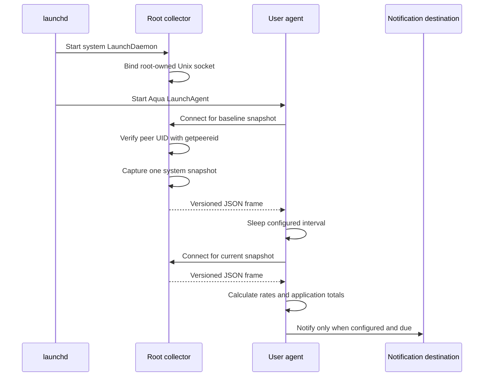

# Service architecture

Harmon separates privileged collection from user-session behavior. This keeps
root access out of Notification Center, Telegram, webhooks, and future UI code.

## Components

| Component | launchd domain | Effective user | Responsibilities |
|---|---|---:|---|
| Collector | system LaunchDaemon | root | Read process, VM, swap, CPU, storage, and power counters; serve snapshots |
| Agent | Aqua LaunchAgent | login user | Schedule samples, calculate deltas, group applications, evaluate rules, log, and notify |
| CLI | interactive user process | caller | Run one-shot reports, diagnostics, config checks, and notification tests |

The release currently contains all roles in one Kotlin/Native executable.
Installation places a root-owned copy under `/Library/PrivilegedHelperTools`
and a user-owned copy under `~/.local/bin`. Command dispatch occurs before user
configuration is loaded, so the collector does not read notification secrets
or initiate network delivery.

## Request lifecycle

The collector is request-driven rather than continuously polling. One accepted
connection produces one snapshot. The agent determines the interval and needs
two snapshots to calculate rates.

## IPC protocol

The default endpoint is `/var/run/harmon.collector.sock`. It lives directly in
the boot-managed `/var/run` directory, so the collector does not depend on a
custom runtime directory surviving a restart.

Each response is:

1. a four-byte unsigned payload length in network byte order;
2. one UTF-8 JSON document of exactly that length;
3. connection close.

The frame limit is 32 MiB. Socket send and receive operations have 30-second
timeouts. JSON is generated and parsed with `kotlinx.serialization`; the
envelope contains a protocol version and a `RawSystemSnapshot`. Unknown fields
are rejected so a version mismatch fails explicitly instead of silently
changing metric meaning.

No request body or mutation command exists. Connecting only asks for a fresh
snapshot.

## Local authorization

The installer records the login user's numeric UID and primary GID in the
LaunchDaemon plist.

- the socket directory is root-owned;
- the socket is created with mode `0660`;
- the collector assigns the configured primary group;
- every accepted connection is checked with `getpeereid`;
- only the configured UID and root are accepted;
- the client also checks the connected server's peer UID and accepts only root
  (or its own UID for explicit local development mode).

File mode is therefore only the first check. A different local account that
shares a group is still rejected by peer UID.

The collector refuses to start without root unless the explicit
`--allow-unprivileged` development switch is supplied. Development mode is
intended only for a socket under `/tmp` and does not improve process access.

## Failure behavior

- A failed collector startup exits; launchd throttles and restarts it.
- A rejected peer is closed without taking a snapshot.
- A per-process access failure does not fail the snapshot. It is counted and,
  up to the diagnostic capacity, recorded with available PID metadata.
- Failure of required global swap, physical-memory, CPU, or VM collection
  aborts that request.
- Battery and internal-storage collection are optional. Their output is marked
  unavailable when the APIs do not produce data.
- If an agent interval fails, its previous valid snapshot remains the
  baseline. The next successful interval covers the full monotonic duration.
- Notifications never run in the collector and cannot terminate it.

## Privilege boundary and residual risk

Root is used to pass Darwin's same-user process-information policy. It is not a
promise of complete visibility: mandatory access-control hooks and platform
protections may still reject a PID.

The snapshot contains process names, UIDs, parent relationships, and executable
paths. This is sensitive local metadata. The socket must not be exposed beyond
the configured account. Standard webhook payloads deliberately omit executable
paths and detailed collection failures.

The root process currently links the same executable image as the user agent,
including notification and HTTP code, although its command path does not call
them. A future hardening step can split the build into distinct collector and
agent binaries without changing the versioned snapshot protocol.

## Future UI

A UI should run as the login user and consume the same agent-side
`SystemUsage`/`MonitoringReport` model. It should not gain root privileges.
Possible evolutions are:

- have the agent persist bounded time-series data for the UI;
- add a separate read-only user socket owned by the agent;
- keep the existing collector protocol private to the agent;
- version storage schemas independently from collector IPC.
