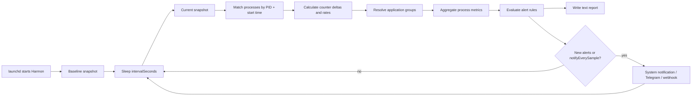

# Agent collection model

This document describes what the Harmon launchd agent collects, where each
value comes from, how cumulative counters become interval metrics, and what is
sent outside the machine.

## Collection lifecycle

Harmon is a long-running user LaunchAgent. It does not continuously inspect the
system. Instead, it takes discrete snapshots separated by the configured
interval.



In continuous mode, the first report appears after one complete
`intervalSeconds` window. In `once` mode, Harmon takes a baseline snapshot,
waits `onceSampleSeconds`, takes a second snapshot, prints the report, and
exits. `diagnose` uses the same two-snapshot calculation and appends grouping
details and the inventory of processes whose resource metrics were unavailable.

## macOS data sources

The Kotlin collector calls a small C interoperability bridge in
`cinterop/harmon_native.def`.

| Scope | Source | Values used |
|---|---|---|
| Process enumeration | `proc_listallpids` | All PIDs returned by the kernel |
| Process identity | `proc_pidinfo(PROC_PIDTBSDINFO)` | Parent PID and UID |
| Process name | `proc_name`, with `pbi_name`/`pbi_comm` fallback | Display name |
| Executable location | `proc_pidpath` | Local application grouping and diagnostics |
| Process resources | `proc_pid_rusage(RUSAGE_INFO_V4)` | CPU time, memory, wakeups, disk I/O, start time and billed energy |
| SWAP | `sysctlbyname("vm.swapusage")` | Allocated, available and used bytes; encryption flag |
| Physical memory | `sysctlbyname("hw.memsize")` | Installed physical memory |
| Power source | IOKit power-source APIs | AC/battery state, charge state and percentage |
| Remaining battery time | `IOPSGetTimeRemainingEstimate` | Estimated minutes remaining, when available |
| Wall-clock timestamp | `Clock.System.now()` | Report timestamp |
| Sampling clock | `clock_gettime(CLOCK_MONOTONIC)` | Stable elapsed time unaffected by wall-clock changes |

The collector has room for 16,384 readable process records and 4,096 detailed
collection issues per snapshot. It scans each listed PID once, so collection
work is proportional to the number of processes.

## Per-process fields

For every readable process, the raw snapshot contains:

| Field | Meaning |
|---|---|
| `pid` | Process ID at the time of the snapshot |
| `startedAt` | Darwin absolute process start time |
| `parentPid` | Parent process ID |
| `uid` | Effective user ID, or `null` when metadata cannot be read |
| `name` | Process name, not its full command line |
| `executablePath` | Full executable path, used locally for application grouping |
| `userTimeNs` | Cumulative user-mode CPU time |
| `systemTimeNs` | Cumulative kernel-mode CPU time |
| `packageIdleWakeups` | Cumulative package-idle wakeups |
| `interruptWakeups` | Cumulative interrupt wakeups |
| `diskBytesRead` | Cumulative disk bytes read |
| `diskBytesWritten` | Cumulative disk bytes written |
| `residentBytes` | Current resident set size |
| `physicalFootprintBytes` | Current physical memory footprint |
| `billedEnergy` | Raw cumulative macOS billed-energy counter |

Harmon deliberately identifies a process by `(pid, startedAt)`, not by PID
alone. This prevents a newly created process from inheriting deltas from an
older process whose PID was reused.

### Memory interpretation

`residentBytes` is the process's current resident set. The primary memory value
used for ranking and alerts is `physicalFootprintBytes`, which is closer to the
physical-memory pressure attributable to the process.

Memory values are point-in-time gauges. They do not need two snapshots and are
available for processes that appeared during the current window.

## Rate calculations

CPU, wakeups, disk I/O and billed energy are cumulative counters. Harmon
subtracts the previous value from the current value and divides by the actual
monotonic sampling duration.

Let:

```text
elapsedSeconds = (current.monotonicNs - previous.monotonicNs) / 1,000,000,000
```

Then:

```text
userCpuPercent =
    delta(userTimeNs) / 1,000,000,000 / elapsedSeconds × 100

systemCpuPercent =
    delta(systemTimeNs) / 1,000,000,000 / elapsedSeconds × 100

cpuPercent = userCpuPercent + systemCpuPercent

wakeupsPerSecond =
    delta(packageIdleWakeups + interruptWakeups) / elapsedSeconds

diskReadBytesPerSecond = delta(diskBytesRead) / elapsedSeconds
diskWriteBytesPerSecond = delta(diskBytesWritten) / elapsedSeconds
billedEnergyPerSecond = delta(billedEnergy) / elapsedSeconds
```

Like Activity Monitor, process CPU can exceed 100% when a process uses more
than one logical core.

If a process has no matching baseline, or a counter unexpectedly moves
backwards, its rate for that counter is reported as zero. Harmon never treats a
process's lifetime total as work performed during the current window.

## Application grouping

Reports and alerts operate on application groups rather than individual
processes. The raw process list remains available for JSON detail and
diagnostics.

Grouping follows three deterministic rules:

1. If an executable path is inside a macOS `.app` bundle, the process belongs
   to the outermost bundle in that path.
2. If a process has no bundle in its own path, it inherits the bundle of its
   nearest readable ancestor.
3. If neither rule resolves a bundle, the process remains a standalone
   one-process group.

Using the outermost bundle is important for nested helpers. For example, all of
these resolve to `/Applications/Firefox.app`:

```text
/Applications/Firefox.app/Contents/MacOS/firefox
/Applications/Firefox.app/Contents/MacOS/crashhelper
/Applications/Firefox.app/Contents/MacOS/gpu-helper.app/Contents/MacOS/Firefox GPU Helper
/Applications/Firefox.app/Contents/MacOS/plugin-container.app/Contents/MacOS/plugin-container
```

This also captures a helper that has been reparented to launchd, as long as its
executable remains inside the application bundle. Grouping is deliberately not
based only on a process name: unrelated commands with the same name must not be
merged.

Each rate, counter-derived value, and memory gauge in an application group is
the sum of its readable member processes:

```text
application.cpuPercent = Σ process.cpuPercent
application.physicalFootprintBytes = Σ process.physicalFootprintBytes
application.wakeupsPerSecond = Σ process.wakeupsPerSecond
application.batteryImpactScore = Σ process.batteryImpactScore
```

Summed physical footprints are useful for ranking applications, but they are
not a perfect measurement of unique RAM because macOS can account shared pages
in more than one process. Multiple running instances from the same bundle path
are intentionally treated as one application.

The bundle path is converted to a stable, non-cryptographic identifier for
JSON and alert keys. The literal path is not sent in the standard webhook
payload.

There are two important limits:

- a helper outside the `.app` bundle that has also been reparented away from a
  readable app ancestor remains standalone;
- a process whose resource record cannot be read contributes no CPU, memory,
  wakeup, I/O, or energy value to its group.

Supporting the first case comprehensively would require an additional public
ownership signal or explicit user grouping overrides. Harmon does not depend
on Activity Monitor's private grouping implementation.

## Battery-impact ranking

Harmon does not claim to reproduce Activity Monitor's private `Energy Impact`
algorithm. It calculates a transparent ranking score:

```text
I/O MiB/s =
    (diskReadBytesPerSecond + diskWriteBytesPerSecond) / 1,048,576

batteryImpactScore =
    cpuPercent + wakeupsPerSecond × 0.25 + I/O MiB/s × 2
```

The score is suitable for relative ranking and alert thresholds, not for
reporting watts or joules. The raw `billedEnergyPerSecond` value is exported
separately without assigning it a physical unit.

Harmon always calculates the ranking, including while connected to AC power.
Battery-impact alerts are emitted only while the Mac is running on battery.

This model currently does not account directly for GPU work, network traffic,
display brightness, thermal pressure, or external devices.

## System-level fields

Each snapshot also contains:

- installed physical memory;
- SWAP allocated, available and used bytes;
- whether SWAP is encrypted;
- whether an internal battery is present;
- AC versus battery power;
- charging state;
- battery percentage, if provided by IOKit;
- estimated minutes remaining, if provided by IOKit;
- total, readable and inaccessible process counts.

SWAP alerts use an absolute used-byte threshold. macOS changes the allocated
swap pool dynamically, so a percentage of the currently allocated pool would
be misleading.

## Inaccessible and disappearing processes

Process inspection can fail because:

- macOS protects the process from the current user;
- the process exits between enumeration and inspection;
- metadata is temporarily unavailable;
- the fixed collector capacity is exceeded.

These cases do not fail the whole snapshot. They increase
`inaccessibleProcessCount`. For up to 4,096 cases per snapshot, Harmon also
retains:

- PID and any readable parent PID and UID;
- process name and executable path when macOS exposes them;
- a normalized reason: permission denied, exited during collection, resource
  usage unavailable, or collector capacity;
- the original `errno`, when applicable.

Run:

```shell
harmon diagnose --sample-seconds 2
```

to print every multi-process application group and every retained collection
issue. The normal daemon log only shows coverage counts and does not emit full
executable paths.

A failure to read SWAP or physical-memory information does fail the snapshot,
because those values are required for a coherent system report. Battery read
failure is non-fatal and produces `batteryAvailable=false`.

The user LaunchAgent intentionally runs without root privileges so that it can
participate in the logged-in Aqua session and display notifications. Complete
system-wide access would require a separate privileged collector and an IPC
boundary to the user agent.

## Alert evaluation

All readable processes participate in grouping. Rules are evaluated against
the resulting application totals, even though reports include only the
configured top-N lists.

| Rule | Default threshold | Critical condition |
|---|---:|---:|
| Application CPU | 150% | At least twice the configured threshold |
| Application physical footprint | 2,048 MiB | At least twice the configured threshold |
| Used SWAP | 1,024 MiB | At least twice the configured threshold |
| Application battery-impact score | 100, on battery only | At least twice the configured threshold |
| Low battery | 20% | 10% or lower |

A threshold is configured through `applicationCpuAlertPercent`,
`applicationMemoryAlertMiB`, `applicationBatteryImpactAlertScore`,
`swapAlertMiB`, or `batteryLowAlertPercent`. The former process-oriented names
remain accepted as compatibility aliases.

A threshold value of zero disables that rule. At most
`maxAlertsPerCategory` applications are selected for each application rule.

Bundle-based alert keys use the stable application-group identifier.
Standalone-process keys contain the PID and process start time. Delivered
alerts are suppressed for `alertCooldownSeconds` (30 minutes by default), and
cooldown state resets when the agent restarts.

## Reporting and external delivery

Every successful interval writes a text report to standard output. Under
launchd, this becomes:

```text
~/Library/Logs/Harmon/harmon.log
```

The text report contains power and SWAP summaries, readable/inaccessible
counts, application-group counts, the configured top-N applications by CPU,
memory and battery-impact score, and active alerts.

Notifications are sent when at least one alert is outside its cooldown, or on
every sample when `notifyEverySample=true`.

### System notifications

The native bridge invokes `/usr/bin/osascript` with a fixed AppleScript and
passes the title, subtitle and message as separate arguments. Process data is
not interpolated into executable AppleScript source.

### Webhook

The webhook receives an HTTPS `POST` with `Content-Type: application/json`.
Loopback HTTP is permitted only for `127.0.0.1` development endpoints. An
optional bearer token is passed in the `Authorization` header.

The payload is encoded with `kotlinx.serialization` and contains:

```json
{
  "event": "harmon.sample",
  "capturedAt": "2026-07-27T14:53:00.570536Z",
  "elapsedSeconds": 300.01,
  "power": {
    "available": true,
    "onBattery": true,
    "charging": false,
    "percentage": 74,
    "minutesRemaining": 215
  },
  "swap": {
    "usedBytes": 1073741824,
    "totalBytes": 2147483648,
    "encrypted": true
  },
  "applications": {
    "total": 487,
    "topCpu": [],
    "topMemory": [],
    "topBatteryImpact": []
  },
  "processes": {
    "total": 808,
    "readable": 559,
    "inaccessible": 249,
    "topCpu": [],
    "topMemory": [],
    "topBatteryImpact": []
  },
  "alerts": []
}
```

Each exported application entry contains its opaque ID, display name, root PID,
process count, aggregate CPU percentage, physical footprint, wakeup rate, disk
rates, billed-energy rate, and battery-impact score. Raw process top-N arrays
are retained for detailed consumers and contain PID, name, UID, and the same
per-process metrics. The arrays can contain the same application or process
because each metric is ranked independently.

Executable paths and collection-issue details are intentionally excluded from
the standard webhook payload.

### Telegram

Telegram receives a compact text rendering through the Bot API. The request
body is also generated with `kotlinx.serialization` and is limited to 4,000
characters.

HTTP delivery is synchronous and bounded by `httpTimeoutSeconds`. Delivery
errors are written to the error log and do not terminate the collection loop.

## Local diagnostic data and privacy

Harmon reads executable paths because they are the public signal used to map
helpers back to their outermost `.app` bundle. Paths and collection issues are
kept only in the current in-memory snapshot. They appear in terminal output
only when the operator explicitly runs `harmon diagnose`.

The current agent does not collect:

- command-line arguments or environment variables of other processes;
- open files;
- per-process network traffic;
- window titles or document contents;
- GPU utilization;
- temperature or fan speed;
- screenshots, keystrokes, or clipboard data;
- a persistent history database.

Application and process names and top-N metrics do appear in local logs and
configured notification destinations. Full executable paths and inaccessible
PID details do not. Harmon makes no network requests unless Telegram or a
webhook is configured and a notification is due.

## Failure and restart behavior

If the initial snapshot fails, Harmon logs the error and retries after 10
seconds. If a later snapshot fails, the error is logged and the previous valid
snapshot remains the baseline. The next successful calculation therefore spans
the full elapsed monotonic window, including the failed interval.

launchd starts the agent at login and restarts it after an unsuccessful exit.
Collection and analysis run sequentially on one agent thread. System
notification delivery may briefly start `/usr/bin/osascript` as a child
process.
